# Performance Comparision

This project contains projects with various performance techniques.

## Frameworks

See the follow for more information on framework-specific notes:

* [Spring Boot](./spring-boot-service/README.md)

## Prepping tests

The test scripts make use of [vegeta](https://github.com/tsenart/vegeta) or [Grafana K6](https://github.com/grafana/k6).

```shell
brew install vegeta
```

and/or

```shell
brew install k6
```

To use the [xk6 Dashboard](https://github.com/grafana/xk6-dashboard), you'll need to install Go and xk6:

```shell
brew install golang
go install go.k6.io/xk6/cmd/xk6@latest
go install github.com/grafana/xk6-dashboard/cmd/k6-web-dashboard@latest
xk6 build --with github.com/grafana/xk6-dashboard@latest
```

> [!CAUTION]
> xk6 has now produced a new k6 binary which may be different than the command on your system path!
> Be sure to run './k6 run <SCRIPT_NAME>' from the '/Users/userA' [or '/home/userA' on Linux] directory.

Launch the service to test:

```shell
cd spring-boot-service
./mvnw clean package
docker compose up --build --force-recreate
```

## Run tests

Vegeta:
```shell
cd ./scripts/vegeta
./vegeta-test.sh
./vegeta-report.sh
```

and/or

Grafana K6:
```shell
cd ./scripts/k6
./k6-test.sh
```

or optionally as individual with dashboard view:
```shell
./k6-test-dashboard.sh
```


# Spring Boot Test Results

### Async (Non-Virtual Threads)

<details>
  <summary>Expand to View Vegeta Report</summary>

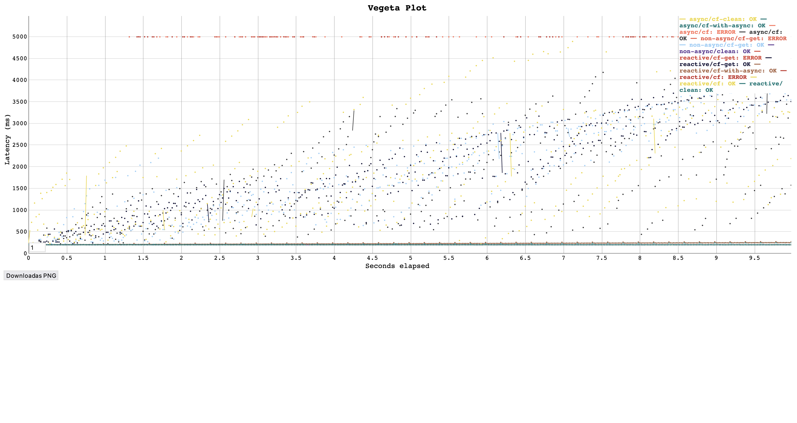
  
```shell
=======================================
./results_async_cf-clean.bin
Bucket           #    %        Histogram
[0s,     100ms]  0    0.00%
[100ms,  200ms]  0    0.00%
[200ms,  300ms]  500  100.00%  ###########################################################################
[300ms,  500ms]  0    0.00%
[500ms,  1s]     0    0.00%
[1s,     2s]     0    0.00%
[2s,     3s]     0    0.00%
[3s,     5s]     0    0.00%
[5s,     +Inf]   0    0.00%
Requests      [total, rate, throughput]         500, 50.10, 49.11
Duration      [total, attack, wait]             10.182s, 9.98s, 202.003ms
Latencies     [min, mean, 50, 90, 95, 99, max]  201.236ms, 202.073ms, 202.064ms, 202.606ms, 202.783ms, 203.227ms, 204.357ms
Bytes In      [total, mean]                     6500, 13.00
Bytes Out     [total, mean]                     0, 0.00
Success       [ratio]                           100.00%
Status Codes  [code:count]                      200:500
Error Set:
=======================================
./results_async_cf-with-async.bin
Bucket           #    %        Histogram
[0s,     100ms]  0    0.00%
[100ms,  200ms]  0    0.00%
[200ms,  300ms]  500  100.00%  ###########################################################################
[300ms,  500ms]  0    0.00%
[500ms,  1s]     0    0.00%
[1s,     2s]     0    0.00%
[2s,     3s]     0    0.00%
[3s,     5s]     0    0.00%
[5s,     +Inf]   0    0.00%
Requests      [total, rate, throughput]         500, 50.10, 48.87
Duration      [total, attack, wait]             10.232s, 9.981s, 251.262ms
Latencies     [min, mean, 50, 90, 95, 99, max]  202.378ms, 227.285ms, 227.048ms, 246.484ms, 248.808ms, 252.091ms, 252.725ms
Bytes In      [total, mean]                     6500, 13.00
Bytes Out     [total, mean]                     0, 0.00
Success       [ratio]                           100.00%
Status Codes  [code:count]                      200:500
Error Set:
=======================================
./results_async_cf.bin
Bucket           #    %       Histogram
[0s,     100ms]  0    0.00%
[100ms,  200ms]  0    0.00%
[200ms,  300ms]  20   4.00%   ###
[300ms,  500ms]  37   7.40%   #####
[500ms,  1s]     101  20.20%  ###############
[1s,     2s]     126  25.20%  ##################
[2s,     3s]     91   18.20%  #############
[3s,     5s]     72   14.40%  ##########
[5s,     +Inf]   53   10.60%  #######
Requests      [total, rate, throughput]         500, 50.10, 30.80
Duration      [total, attack, wait]             14.514s, 9.981s, 4.533s
Latencies     [min, mean, 50, 90, 95, 99, max]  202.297ms, 2.034s, 1.646s, 5s, 5s, 5.001s, 5.001s
Bytes In      [total, mean]                     5811, 11.62
Bytes Out     [total, mean]                     0, 0.00
Success       [ratio]                           89.40%
Status Codes  [code:count]                      0:53  200:447
Error Set:
Get "http://localhost:8080/async/cf": context deadline exceeded (Client.Timeout exceeded while awaiting headers)
=======================================
./results_non-async_cf-get.bin
Bucket           #    %       Histogram
[0s,     100ms]  0    0.00%
[100ms,  200ms]  0    0.00%
[200ms,  300ms]  24   4.80%   ###
[300ms,  500ms]  35   7.00%   #####
[500ms,  1s]     62   12.40%  #########
[1s,     2s]     129  25.80%  ###################
[2s,     3s]     121  24.20%  ##################
[3s,     5s]     108  21.60%  ################
[5s,     +Inf]   21   4.20%   ###
Requests      [total, rate, throughput]         500, 50.10, 34.44
Duration      [total, attack, wait]             13.91s, 9.98s, 3.93s
Latencies     [min, mean, 50, 90, 95, 99, max]  203.148ms, 2.094s, 1.999s, 3.725s, 4.031s, 5s, 5.001s
Bytes In      [total, mean]                     6227, 12.45
Bytes Out     [total, mean]                     0, 0.00
Success       [ratio]                           95.80%
Status Codes  [code:count]                      0:21  200:479
Error Set:
Get "http://localhost:8080/non-async/cf-get": context deadline exceeded (Client.Timeout exceeded while awaiting headers)
=======================================
./results_non-async_clean.bin
Bucket           #    %        Histogram
[0s,     100ms]  0    0.00%
[100ms,  200ms]  0    0.00%
[200ms,  300ms]  500  100.00%  ###########################################################################
[300ms,  500ms]  0    0.00%
[500ms,  1s]     0    0.00%
[1s,     2s]     0    0.00%
[2s,     3s]     0    0.00%
[3s,     5s]     0    0.00%
[5s,     +Inf]   0    0.00%
Requests      [total, rate, throughput]         500, 50.10, 49.11
Duration      [total, attack, wait]             10.182s, 9.98s, 201.817ms
Latencies     [min, mean, 50, 90, 95, 99, max]  201.029ms, 201.98ms, 201.985ms, 202.527ms, 202.733ms, 203.047ms, 203.75ms
Bytes In      [total, mean]                     6500, 13.00
Bytes Out     [total, mean]                     0, 0.00
Success       [ratio]                           100.00%
Status Codes  [code:count]                      200:500
Error Set:
=======================================
./results_reactive_cf-get.bin
Bucket           #    %       Histogram
[0s,     100ms]  0    0.00%
[100ms,  200ms]  0    0.00%
[200ms,  300ms]  22   4.40%   ###
[300ms,  500ms]  16   3.20%   ##
[500ms,  1s]     75   15.00%  ###########
[1s,     2s]     144  28.80%  #####################
[2s,     3s]     113  22.60%  ################
[3s,     5s]     109  21.80%  ################
[5s,     +Inf]   21   4.20%   ###
Requests      [total, rate, throughput]         500, 50.10, 34.24
Duration      [total, attack, wait]             13.988s, 9.98s, 4.008s
Latencies     [min, mean, 50, 90, 95, 99, max]  203.104ms, 2.106s, 1.922s, 3.711s, 4.045s, 5.001s, 5.001s
Bytes In      [total, mean]                     6227, 12.45
Bytes Out     [total, mean]                     0, 0.00
Success       [ratio]                           95.80%
Status Codes  [code:count]                      0:21  200:479
Error Set:
Get "http://localhost:8080/reactive/cf-get": context deadline exceeded (Client.Timeout exceeded while awaiting headers)
=======================================
./results_reactive_cf-with-async.bin
Bucket           #    %        Histogram
[0s,     100ms]  0    0.00%
[100ms,  200ms]  0    0.00%
[200ms,  300ms]  500  100.00%  ###########################################################################
[300ms,  500ms]  0    0.00%
[500ms,  1s]     0    0.00%
[1s,     2s]     0    0.00%
[2s,     3s]     0    0.00%
[3s,     5s]     0    0.00%
[5s,     +Inf]   0    0.00%
Requests      [total, rate, throughput]         500, 50.10, 48.76
Duration      [total, attack, wait]             10.255s, 9.981s, 274.505ms
Latencies     [min, mean, 50, 90, 95, 99, max]  202.531ms, 229.822ms, 229.902ms, 249.879ms, 253.371ms, 269.975ms, 274.505ms
Bytes In      [total, mean]                     6500, 13.00
Bytes Out     [total, mean]                     0, 0.00
Success       [ratio]                           100.00%
Status Codes  [code:count]                      200:500
Error Set:
=======================================
./results_reactive_cf.bin
Bucket           #    %       Histogram
[0s,     100ms]  0    0.00%
[100ms,  200ms]  0    0.00%
[200ms,  300ms]  7    1.40%   #
[300ms,  500ms]  29   5.80%   ####
[500ms,  1s]     87   17.40%  #############
[1s,     2s]     132  26.40%  ###################
[2s,     3s]     90   18.00%  #############
[3s,     5s]     98   19.60%  ##############
[5s,     +Inf]   57   11.40%  ########
Requests      [total, rate, throughput]         500, 50.10, 29.90
Duration      [total, attack, wait]             14.818s, 9.979s, 4.838s
Latencies     [min, mean, 50, 90, 95, 99, max]  220.456ms, 2.287s, 1.969s, 5s, 5.001s, 5.001s, 5.001s
Bytes In      [total, mean]                     5759, 11.52
Bytes Out     [total, mean]                     0, 0.00
Success       [ratio]                           88.60%
Status Codes  [code:count]                      0:57  200:443
Error Set:
Get "http://localhost:8080/reactive/cf": context deadline exceeded (Client.Timeout exceeded while awaiting headers)
=======================================
./results_reactive_clean.bin
Bucket           #    %        Histogram
[0s,     100ms]  0    0.00%
[100ms,  200ms]  0    0.00%
[200ms,  300ms]  500  100.00%  ###########################################################################
[300ms,  500ms]  0    0.00%
[500ms,  1s]     0    0.00%
[1s,     2s]     0    0.00%
[2s,     3s]     0    0.00%
[3s,     5s]     0    0.00%
[5s,     +Inf]   0    0.00%
Requests      [total, rate, throughput]         500, 50.10, 49.10
Duration      [total, attack, wait]             10.183s, 9.98s, 202.893ms
Latencies     [min, mean, 50, 90, 95, 99, max]  201.183ms, 202.074ms, 202.07ms, 202.714ms, 202.89ms, 203.42ms, 205.215ms
Bytes In      [total, mean]                     6500, 13.00
Bytes Out     [total, mean]                     0, 0.00
Success       [ratio]                           100.00%
Status Codes  [code:count]                      200:500
Error Set:
```
</details>


<details>
  <summary>non-async/clean - Expand to View K6 Report</summary>

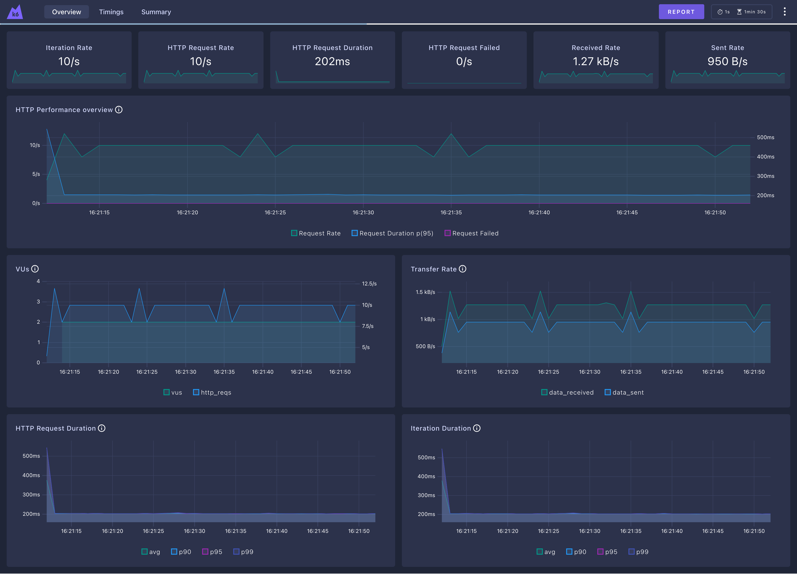

```shell
Testing 'non-async/clean' ...

         /\      Grafana   /‾‾/  
    /\  /  \     |\  __   /  /   
   /  \/    \    | |/ /  /   ‾‾\ 
  /          \   |   (  |  (‾)  |
 / __________ \  |_|\_\  \_____/ 

     execution: local
        script: k6-tests-template.js
        output: dashboard http://127.0.0.1:5665

     scenarios: (100.00%) 1 scenario, 2 max VUs, 1m30s max duration (incl. graceful stop):
              * default: 400 iterations shared among 2 VUs (maxDuration: 1m0s, gracefulStop: 30s)


     █ non-async/clean

       ✓ status is 200

     checks.........................: 100.00% 400 out of 400
     data_received..................: 51 kB   1.2 kB/s
     data_sent......................: 38 kB   926 B/s
     group_duration.................: avg=205.06ms min=201.89ms med=203.14ms max=547.35ms p(90)=204.23ms p(95)=204.48ms
     http_req_blocked...............: avg=13.32µs  min=2µs      med=4µs      max=1.65ms   p(90)=5µs      p(95)=7µs     
     http_req_connecting............: avg=1.96µs   min=0s       med=0s       max=227µs    p(90)=0s       p(95)=0s      
     http_req_duration..............: avg=204.94ms min=201.8ms  med=203.05ms max=544.16ms p(90)=204.07ms p(95)=204.36ms
       { expected_response:true }...: avg=204.94ms min=201.8ms  med=203.05ms max=544.16ms p(90)=204.07ms p(95)=204.36ms
     http_req_failed................: 0.00%   0 out of 400
     http_req_receiving.............: avg=59.48µs  min=24µs     med=52µs     max=1.02ms   p(90)=75µs     p(95)=85.04µs 
     http_req_sending...............: avg=16.28µs  min=7µs      med=13µs     max=483µs    p(90)=20µs     p(95)=25µs    
     http_req_tls_handshaking.......: avg=0s       min=0s       med=0s       max=0s       p(90)=0s       p(95)=0s      
     http_req_waiting...............: avg=204.86ms min=201.74ms med=202.99ms max=543.96ms p(90)=203.97ms p(95)=204.27ms
     http_reqs......................: 400     9.750771/s
     iteration_duration.............: avg=205.09ms min=201.91ms med=203.16ms max=548.14ms p(90)=204.26ms p(95)=204.52ms
     iterations.....................: 400     9.750771/s
     vus............................: 2       min=2          max=2
     vus_max........................: 2       min=2          max=2


running (0m41.0s), 0/2 VUs, 400 complete and 0 interrupted iterations
default ✓ [======================================] 2 VUs  0m41.0s/1m0s  400/400 shared iters
```
</details>

<details>
  <summary>non-async/cf-get - Expand to View K6 Report</summary>

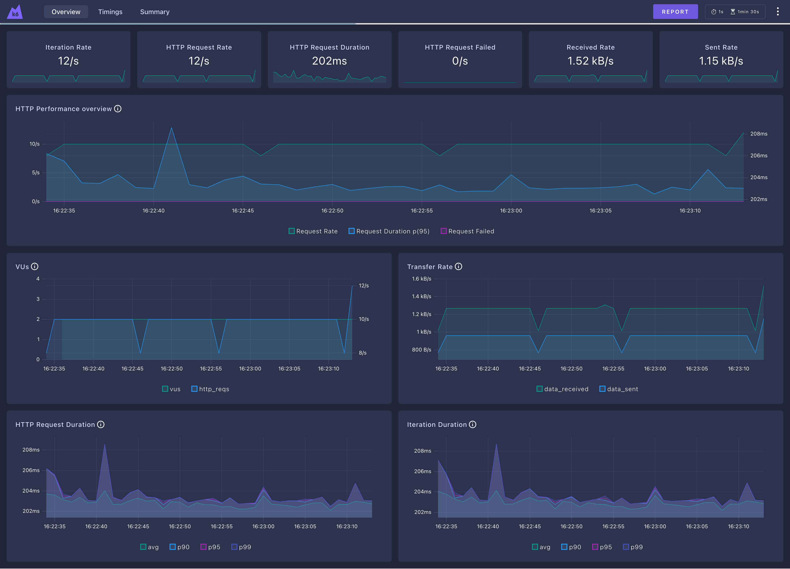

```shell
Testing 'non-async/cf-get' ...

         /\      Grafana   /‾‾/  
    /\  /  \     |\  __   /  /   
   /  \/    \    | |/ /  /   ‾‾\ 
  /          \   |   (  |  (‾)  |
 / __________ \  |_|\_\  \_____/ 

     execution: local
        script: k6-tests-template.js
        output: dashboard http://127.0.0.1:5665

     scenarios: (100.00%) 1 scenario, 2 max VUs, 1m30s max duration (incl. graceful stop):
              * default: 400 iterations shared among 2 VUs (maxDuration: 1m0s, gracefulStop: 30s)


     █ non-async/cf-get

       ✓ status is 200

     checks.........................: 100.00% 400 out of 400
     data_received..................: 51 kB   1.3 kB/s
     data_sent......................: 38 kB   946 B/s
     group_duration.................: avg=202.92ms min=201.67ms med=202.88ms max=208.68ms p(90)=203.48ms p(95)=203.84ms
     http_req_blocked...............: avg=7.94µs   min=2µs      med=4µs      max=511µs    p(90)=5µs      p(95)=6.04µs  
     http_req_connecting............: avg=1.57µs   min=0s       med=0s       max=175µs    p(90)=0s       p(95)=0s      
     http_req_duration..............: avg=202.81ms min=201.58ms med=202.77ms max=208.59ms p(90)=203.37ms p(95)=203.7ms 
       { expected_response:true }...: avg=202.81ms min=201.58ms med=202.77ms max=208.59ms p(90)=203.37ms p(95)=203.7ms 
     http_req_failed................: 0.00%   0 out of 400
     http_req_receiving.............: avg=55µs     min=25µs     med=50.5µs   max=259µs    p(90)=75µs     p(95)=88.14µs 
     http_req_sending...............: avg=14.74µs  min=7µs      med=12µs     max=369µs    p(90)=18µs     p(95)=21µs    
     http_req_tls_handshaking.......: avg=0s       min=0s       med=0s       max=0s       p(90)=0s       p(95)=0s      
     http_req_waiting...............: avg=202.74ms min=201.51ms med=202.7ms  max=208.53ms p(90)=203.3ms  p(95)=203.62ms
     http_reqs......................: 400     9.853917/s
     iteration_duration.............: avg=202.94ms min=201.69ms med=202.9ms  max=208.7ms  p(90)=203.5ms  p(95)=203.86ms
     iterations.....................: 400     9.853917/s
     vus............................: 2       min=2          max=2
     vus_max........................: 2       min=2          max=2


running (0m40.6s), 0/2 VUs, 400 complete and 0 interrupted iterations
default ✓ [======================================] 2 VUs  0m40.6s/1m0s  400/400 shared iters
```
</details>

<details>
  <summary>async/cf-clean - Expand to View K6 Report</summary>

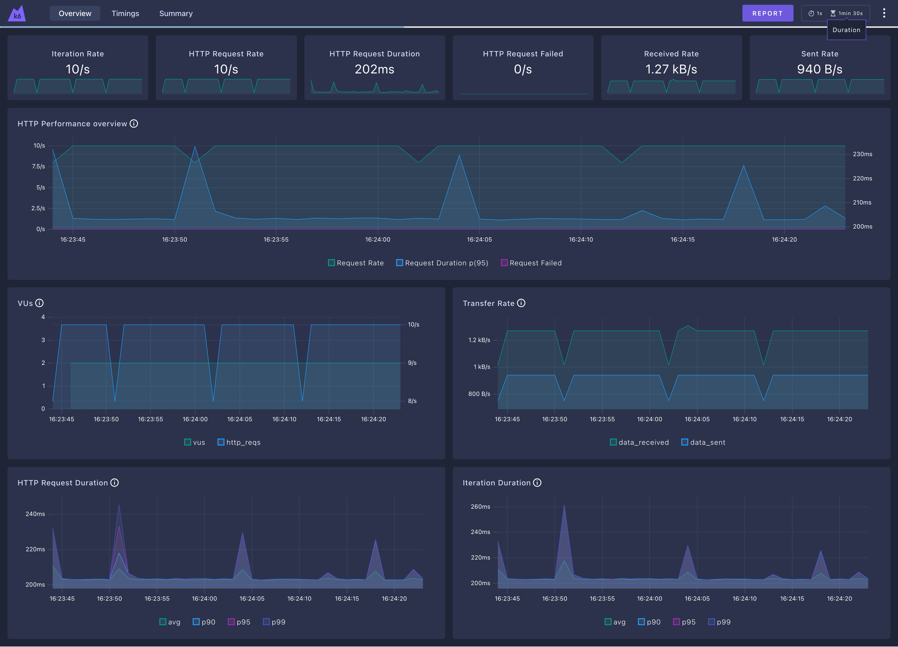

```shellTesting 'async/cf-clean' ...

         /\      Grafana   /‾‾/  
    /\  /  \     |\  __   /  /   
   /  \/    \    | |/ /  /   ‾‾\ 
  /          \   |   (  |  (‾)  |
 / __________ \  |_|\_\  \_____/ 

     execution: local
        script: k6-tests-template.js
        output: dashboard http://127.0.0.1:5665

     scenarios: (100.00%) 1 scenario, 2 max VUs, 1m30s max duration (incl. graceful stop):
              * default: 400 iterations shared among 2 VUs (maxDuration: 1m0s, gracefulStop: 30s)


     █ async/cf-clean

       ✓ status is 200

     checks.........................: 100.00% 400 out of 400
     data_received..................: 51 kB   1.2 kB/s
     data_sent......................: 38 kB   922 B/s
     group_duration.................: avg=203.77ms min=201.96ms med=203.01ms max=261.5ms  p(90)=203.63ms p(95)=203.8ms 
     http_req_blocked...............: avg=8.04µs   min=2µs      med=3µs      max=497µs    p(90)=5µs      p(95)=7µs     
     http_req_connecting............: avg=2µs      min=0s       med=0s       max=249µs    p(90)=0s       p(95)=0s      
     http_req_duration..............: avg=203.49ms min=201.86ms med=202.91ms max=248.48ms p(90)=203.51ms p(95)=203.69ms
       { expected_response:true }...: avg=203.49ms min=201.86ms med=202.91ms max=248.48ms p(90)=203.51ms p(95)=203.69ms
     http_req_failed................: 0.00%   0 out of 400
     http_req_receiving.............: avg=56.23µs  min=25µs     med=52µs     max=909µs    p(90)=72µs     p(95)=82µs    
     http_req_sending...............: avg=13.31µs  min=6µs      med=11µs     max=156µs    p(90)=17µs     p(95)=19.04µs 
     http_req_tls_handshaking.......: avg=0s       min=0s       med=0s       max=0s       p(90)=0s       p(95)=0s      
     http_req_waiting...............: avg=203.42ms min=201.8ms  med=202.85ms max=247.56ms p(90)=203.43ms p(95)=203.63ms
     http_reqs......................: 400     9.81279/s
     iteration_duration.............: avg=203.79ms min=201.98ms med=203.04ms max=261.55ms p(90)=203.66ms p(95)=203.82ms
     iterations.....................: 400     9.81279/s
     vus............................: 2       min=2          max=2
     vus_max........................: 2       min=2          max=2


running (0m40.8s), 0/2 VUs, 400 complete and 0 interrupted iterations
default ✓ [======================================] 2 VUs  0m40.8s/1m0s  400/400 shared iters
```
</details>

<details>
  <summary>async/cf - Expand to View K6 Report</summary>

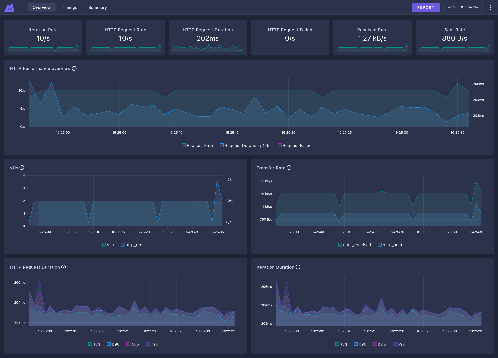

```shell
Testing 'async/cf' ...

         /\      Grafana   /‾‾/  
    /\  /  \     |\  __   /  /   
   /  \/    \    | |/ /  /   ‾‾\ 
  /          \   |   (  |  (‾)  |
 / __________ \  |_|\_\  \_____/ 

     execution: local
        script: k6-tests-template.js
        output: dashboard http://127.0.0.1:5665

     scenarios: (100.00%) 1 scenario, 2 max VUs, 1m30s max duration (incl. graceful stop):
              * default: 400 iterations shared among 2 VUs (maxDuration: 1m0s, gracefulStop: 30s)


     █ async/cf

       ✓ status is 200

     checks.........................: 100.00% 400 out of 400
     data_received..................: 51 kB   1.3 kB/s
     data_sent......................: 35 kB   867 B/s
     group_duration.................: avg=202.95ms min=201.77ms med=202.92ms max=206.71ms p(90)=203.58ms p(95)=203.71ms
     http_req_blocked...............: avg=9.74µs   min=2µs      med=4µs      max=651µs    p(90)=5µs      p(95)=6µs     
     http_req_connecting............: avg=2.78µs   min=0s       med=0s       max=380µs    p(90)=0s       p(95)=0s      
     http_req_duration..............: avg=202.84ms min=201.71ms med=202.81ms max=206.59ms p(90)=203.47ms p(95)=203.59ms
       { expected_response:true }...: avg=202.84ms min=201.71ms med=202.81ms max=206.59ms p(90)=203.47ms p(95)=203.59ms
     http_req_failed................: 0.00%   0 out of 400
     http_req_receiving.............: avg=55.6µs   min=26µs     med=53µs     max=337µs    p(90)=74µs     p(95)=84.04µs 
     http_req_sending...............: avg=13.76µs  min=6µs      med=12µs     max=138µs    p(90)=18µs     p(95)=19.04µs 
     http_req_tls_handshaking.......: avg=0s       min=0s       med=0s       max=0s       p(90)=0s       p(95)=0s      
     http_req_waiting...............: avg=202.77ms min=201.65ms med=202.75ms max=206.54ms p(90)=203.4ms  p(95)=203.51ms
     http_reqs......................: 400     9.852281/s
     iteration_duration.............: avg=202.98ms min=201.79ms med=202.93ms max=206.78ms p(90)=203.61ms p(95)=203.75ms
     iterations.....................: 400     9.852281/s
     vus............................: 2       min=2          max=2
     vus_max........................: 2       min=2          max=2


running (0m40.6s), 0/2 VUs, 400 complete and 0 interrupted iterations
default ✓ [======================================] 2 VUs  0m40.6s/1m0s  400/400 shared iters
```
</details>

<details>
  <summary>async/cf-with-async - Expand to View K6 Report</summary>

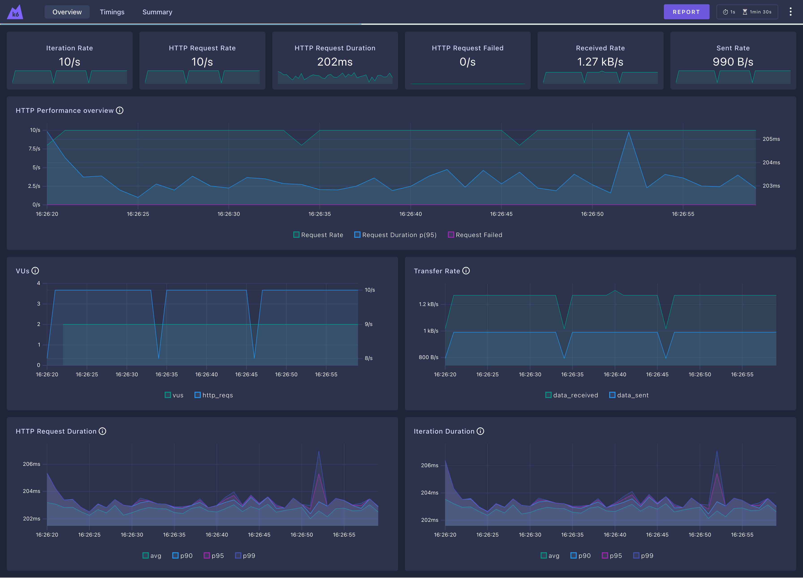

```shell
Testing 'async/cf-with-async' ...

         /\      Grafana   /‾‾/  
    /\  /  \     |\  __   /  /   
   /  \/    \    | |/ /  /   ‾‾\ 
  /          \   |   (  |  (‾)  |
 / __________ \  |_|\_\  \_____/ 

     execution: local
        script: k6-tests-template.js
        output: dashboard http://127.0.0.1:5665

     scenarios: (100.00%) 1 scenario, 2 max VUs, 1m30s max duration (incl. graceful stop):
              * default: 400 iterations shared among 2 VUs (maxDuration: 1m0s, gracefulStop: 30s)


     █ async/cf-with-async

       ✓ status is 200

     checks.........................: 100.00% 400 out of 400
     data_received..................: 51 kB   1.3 kB/s
     data_sent......................: 40 kB   976 B/s
     group_duration.................: avg=202.78ms min=201.63ms med=202.79ms max=207.47ms p(90)=203.34ms p(95)=203.6ms 
     http_req_blocked...............: avg=7.41µs   min=2µs      med=4µs      max=557µs    p(90)=5µs      p(95)=6µs     
     http_req_connecting............: avg=1.61µs   min=0s       med=0s       max=193µs    p(90)=0s       p(95)=0s      
     http_req_duration..............: avg=202.67ms min=201.54ms med=202.69ms max=207.37ms p(90)=203.23ms p(95)=203.49ms
       { expected_response:true }...: avg=202.67ms min=201.54ms med=202.69ms max=207.37ms p(90)=203.23ms p(95)=203.49ms
     http_req_failed................: 0.00%   0 out of 400
     http_req_receiving.............: avg=54.99µs  min=23µs     med=52µs     max=380µs    p(90)=72.1µs   p(95)=79.04µs 
     http_req_sending...............: avg=14.23µs  min=7µs      med=13µs     max=166µs    p(90)=17.1µs   p(95)=20.04µs 
     http_req_tls_handshaking.......: avg=0s       min=0s       med=0s       max=0s       p(90)=0s       p(95)=0s      
     http_req_waiting...............: avg=202.61ms min=201.49ms med=202.63ms max=207.31ms p(90)=203.15ms p(95)=203.41ms
     http_reqs......................: 400     9.860691/s
     iteration_duration.............: avg=202.8ms  min=201.65ms med=202.82ms max=207.49ms p(90)=203.36ms p(95)=203.62ms
     iterations.....................: 400     9.860691/s
     vus............................: 2       min=2          max=2
     vus_max........................: 2       min=2          max=2


running (0m40.6s), 0/2 VUs, 400 complete and 0 interrupted iterations
default ✓ [======================================] 2 VUs  0m40.6s/1m0s  400/400 shared iters
```
</details>

<details>
  <summary>reactive/clean - Expand to View K6 Report</summary>

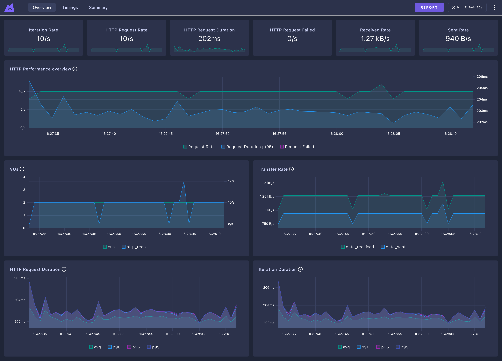

```shell
Testing 'reactive/clean' ...

         /\      Grafana   /‾‾/  
    /\  /  \     |\  __   /  /   
   /  \/    \    | |/ /  /   ‾‾\ 
  /          \   |   (  |  (‾)  |
 / __________ \  |_|\_\  \_____/ 

     execution: local
        script: k6-tests-template.js
        output: dashboard http://127.0.0.1:5665

     scenarios: (100.00%) 1 scenario, 2 max VUs, 1m30s max duration (incl. graceful stop):
              * default: 400 iterations shared among 2 VUs (maxDuration: 1m0s, gracefulStop: 30s)


     █ reactive/clean

       ✓ status is 200

     checks.........................: 100.00% 400 out of 400
     data_received..................: 51 kB   1.3 kB/s
     data_sent......................: 38 kB   928 B/s
     group_duration.................: avg=202.52ms min=201.49ms med=202.33ms max=218.7ms  p(90)=203.08ms p(95)=203.29ms
     http_req_blocked...............: avg=8.3µs    min=2µs      med=3µs      max=648µs    p(90)=5µs      p(95)=6.04µs  
     http_req_connecting............: avg=1.92µs   min=0s       med=0s       max=195µs    p(90)=0s       p(95)=0s      
     http_req_duration..............: avg=202.41ms min=201.4ms  med=202.21ms max=218.56ms p(90)=202.95ms p(95)=203.15ms
       { expected_response:true }...: avg=202.41ms min=201.4ms  med=202.21ms max=218.56ms p(90)=202.95ms p(95)=203.15ms
     http_req_failed................: 0.00%   0 out of 400
     http_req_receiving.............: avg=53.78µs  min=25µs     med=50µs     max=134µs    p(90)=75µs     p(95)=87.04µs 
     http_req_sending...............: avg=13.7µs   min=7µs      med=12µs     max=109µs    p(90)=17µs     p(95)=21µs    
     http_req_tls_handshaking.......: avg=0s       min=0s       med=0s       max=0s       p(90)=0s       p(95)=0s      
     http_req_waiting...............: avg=202.34ms min=201.35ms med=202.15ms max=218.45ms p(90)=202.88ms p(95)=203.06ms
     http_reqs......................: 400     9.873503/s
     iteration_duration.............: avg=202.54ms min=201.51ms med=202.35ms max=218.72ms p(90)=203.11ms p(95)=203.31ms
     iterations.....................: 400     9.873503/s
     vus............................: 2       min=2          max=2
     vus_max........................: 2       min=2          max=2


running (0m40.5s), 0/2 VUs, 400 complete and 0 interrupted iterations
default ✓ [======================================] 2 VUs  0m40.5s/1m0s  400/400 shared iters
```
</details>

<details>
  <summary>reactive/cf-get - Expand to View K6 Report</summary>

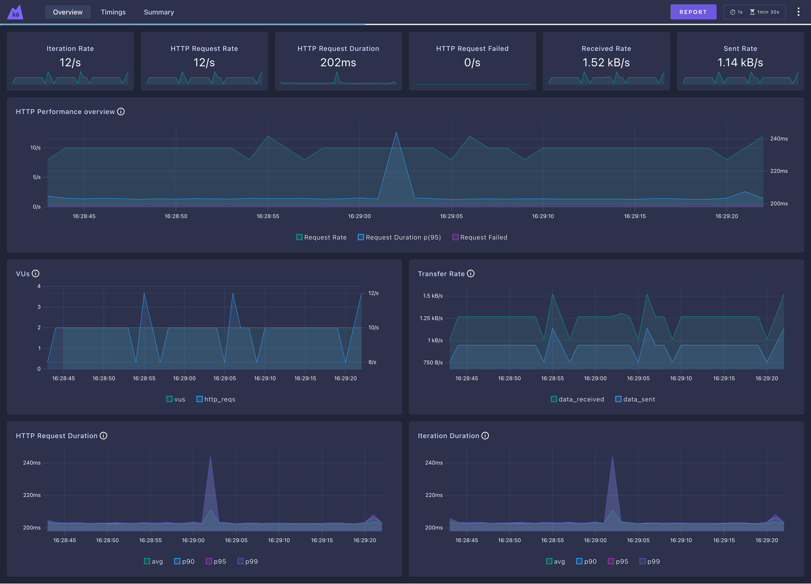

```shell
Testing 'reactive/cf-get' ...

         /\      Grafana   /‾‾/  
    /\  /  \     |\  __   /  /   
   /  \/    \    | |/ /  /   ‾‾\ 
  /          \   |   (  |  (‾)  |
 / __________ \  |_|\_\  \_____/ 

     execution: local
        script: k6-tests-template.js
        output: dashboard http://127.0.0.1:5665

     scenarios: (100.00%) 1 scenario, 2 max VUs, 1m30s max duration (incl. graceful stop):
              * default: 400 iterations shared among 2 VUs (maxDuration: 1m0s, gracefulStop: 30s)


     █ reactive/cf-get

       ✓ status is 200

     checks.........................: 100.00% 400 out of 400
     data_received..................: 51 kB   1.3 kB/s
     data_sent......................: 38 kB   936 B/s
     group_duration.................: avg=202.91ms min=201.75ms med=202.74ms max=244.24ms p(90)=203.28ms p(95)=203.45ms
     http_req_blocked...............: avg=8.12µs   min=2µs      med=4µs      max=589µs    p(90)=5µs      p(95)=6µs     
     http_req_connecting............: avg=1.99µs   min=0s       med=0s       max=202µs    p(90)=0s       p(95)=0s      
     http_req_duration..............: avg=202.8ms  min=201.62ms med=202.62ms max=244.12ms p(90)=203.17ms p(95)=203.32ms
       { expected_response:true }...: avg=202.8ms  min=201.62ms med=202.62ms max=244.12ms p(90)=203.17ms p(95)=203.32ms
     http_req_failed................: 0.00%   0 out of 400
     http_req_receiving.............: avg=55.44µs  min=24µs     med=53µs     max=149µs    p(90)=77µs     p(95)=84.04µs 
     http_req_sending...............: avg=13.49µs  min=6µs      med=12µs     max=106µs    p(90)=17µs     p(95)=20.04µs 
     http_req_tls_handshaking.......: avg=0s       min=0s       med=0s       max=0s       p(90)=0s       p(95)=0s      
     http_req_waiting...............: avg=202.73ms min=201.53ms med=202.54ms max=244.07ms p(90)=203.1ms  p(95)=203.23ms
     http_reqs......................: 400     9.854326/s
     iteration_duration.............: avg=202.93ms min=201.78ms med=202.76ms max=244.27ms p(90)=203.3ms  p(95)=203.47ms
     iterations.....................: 400     9.854326/s
     vus............................: 2       min=2          max=2
     vus_max........................: 2       min=2          max=2


running (0m40.6s), 0/2 VUs, 400 complete and 0 interrupted iterations
default ✓ [======================================] 2 VUs  0m40.6s/1m0s  400/400 shared iters
```
</details>

<details>
  <summary>reactive/cf - Expand to View K6 Report</summary>

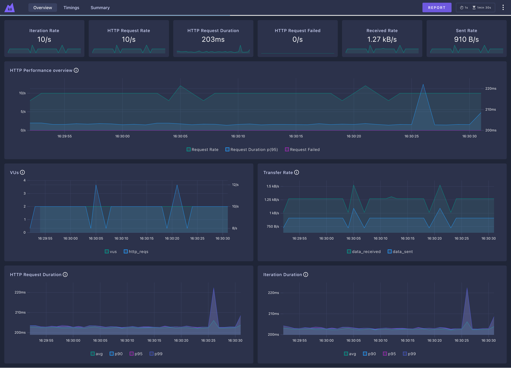

```shell
Testing 'reactive/cf' ...

         /\      Grafana   /‾‾/  
    /\  /  \     |\  __   /  /   
   /  \/    \    | |/ /  /   ‾‾\ 
  /          \   |   (  |  (‾)  |
 / __________ \  |_|\_\  \_____/ 

     execution: local
        script: k6-tests-template.js
        output: dashboard http://127.0.0.1:5665

     scenarios: (100.00%) 1 scenario, 2 max VUs, 1m30s max duration (incl. graceful stop):
              * default: 400 iterations shared among 2 VUs (maxDuration: 1m0s, gracefulStop: 30s)


     █ reactive/cf

       ✓ status is 200

     checks.........................: 100.00% 400 out of 400
     data_received..................: 51 kB   1.3 kB/s
     data_sent......................: 36 kB   898 B/s
     group_duration.................: avg=202.63ms min=201.63ms med=202.51ms max=222.51ms p(90)=203.04ms p(95)=203.42ms
     http_req_blocked...............: avg=7.71µs   min=2µs      med=4µs      max=532µs    p(90)=5.1µs    p(95)=8µs     
     http_req_connecting............: avg=1.61µs   min=0s       med=0s       max=182µs    p(90)=0s       p(95)=0s      
     http_req_duration..............: avg=202.52ms min=201.56ms med=202.42ms max=222.4ms  p(90)=202.93ms p(95)=203.24ms
       { expected_response:true }...: avg=202.52ms min=201.56ms med=202.42ms max=222.4ms  p(90)=202.93ms p(95)=203.24ms
     http_req_failed................: 0.00%   0 out of 400
     http_req_receiving.............: avg=53.41µs  min=24µs     med=51µs     max=152µs    p(90)=72.1µs   p(95)=86µs    
     http_req_sending...............: avg=13.57µs  min=5µs      med=12µs     max=110µs    p(90)=17µs     p(95)=20µs    
     http_req_tls_handshaking.......: avg=0s       min=0s       med=0s       max=0s       p(90)=0s       p(95)=0s      
     http_req_waiting...............: avg=202.46ms min=201.49ms med=202.36ms max=222.33ms p(90)=202.86ms p(95)=203.13ms
     http_reqs......................: 400     9.868077/s
     iteration_duration.............: avg=202.65ms min=201.65ms med=202.54ms max=222.53ms p(90)=203.07ms p(95)=203.44ms
     iterations.....................: 400     9.868077/s
     vus............................: 2       min=2          max=2
     vus_max........................: 2       min=2          max=2


running (0m40.5s), 0/2 VUs, 400 complete and 0 interrupted iterations
default ✓ [======================================] 2 VUs  0m40.5s/1m0s  400/400 shared iters
```
</details>

<details>
  <summary>reactive/cf-with-async - Expand to View K6 Report</summary>

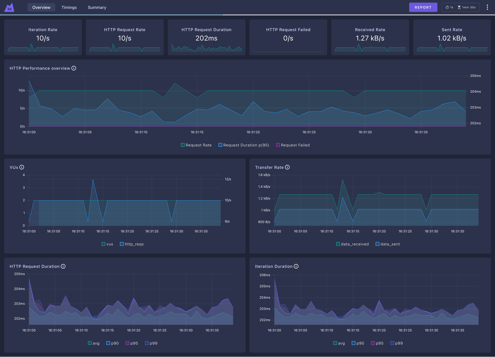

```shell
Testing 'reactive/cf-with-async' ...

         /\      Grafana   /‾‾/  
    /\  /  \     |\  __   /  /   
   /  \/    \    | |/ /  /   ‾‾\ 
  /          \   |   (  |  (‾)  |
 / __________ \  |_|\_\  \_____/ 

     execution: local
        script: k6-tests-template.js
        output: dashboard http://127.0.0.1:5665

     scenarios: (100.00%) 1 scenario, 2 max VUs, 1m30s max duration (incl. graceful stop):
              * default: 400 iterations shared among 2 VUs (maxDuration: 1m0s, gracefulStop: 30s)


     █ reactive/cf-with-async

       ✓ status is 200

     checks.........................: 100.00% 400 out of 400
     data_received..................: 51 kB   1.3 kB/s
     data_sent......................: 41 kB   1.0 kB/s
     group_duration.................: avg=202.35ms min=201.58ms med=202.22ms max=205.59ms p(90)=202.93ms p(95)=203.05ms
     http_req_blocked...............: avg=8.77µs   min=2µs      med=3µs      max=588µs    p(90)=5µs      p(95)=6µs     
     http_req_connecting............: avg=2.08µs   min=0s       med=0s       max=232µs    p(90)=0s       p(95)=0s      
     http_req_duration..............: avg=202.24ms min=201.52ms med=202.11ms max=204.72ms p(90)=202.84ms p(95)=202.92ms
       { expected_response:true }...: avg=202.24ms min=201.52ms med=202.11ms max=204.72ms p(90)=202.84ms p(95)=202.92ms
     http_req_failed................: 0.00%   0 out of 400
     http_req_receiving.............: avg=52.52µs  min=25µs     med=49µs     max=174µs    p(90)=74µs     p(95)=87µs    
     http_req_sending...............: avg=14.2µs   min=5µs      med=12µs     max=139µs    p(90)=18.1µs   p(95)=22µs    
     http_req_tls_handshaking.......: avg=0s       min=0s       med=0s       max=0s       p(90)=0s       p(95)=0s      
     http_req_waiting...............: avg=202.18ms min=201.47ms med=202.05ms max=204.48ms p(90)=202.76ms p(95)=202.86ms
     http_reqs......................: 400     9.881561/s
     iteration_duration.............: avg=202.37ms min=201.59ms med=202.25ms max=205.72ms p(90)=202.95ms p(95)=203.09ms
     iterations.....................: 400     9.881561/s
     vus............................: 2       min=2          max=2
     vus_max........................: 2       min=2          max=2


running (0m40.5s), 0/2 VUs, 400 complete and 0 interrupted iterations
default ✓ [======================================] 2 VUs  0m40.5s/1m0s  400/400 shared iters
```
</details>


### Virtual Threads

<details>
  <summary>Expand to View Vegeta Report</summary>

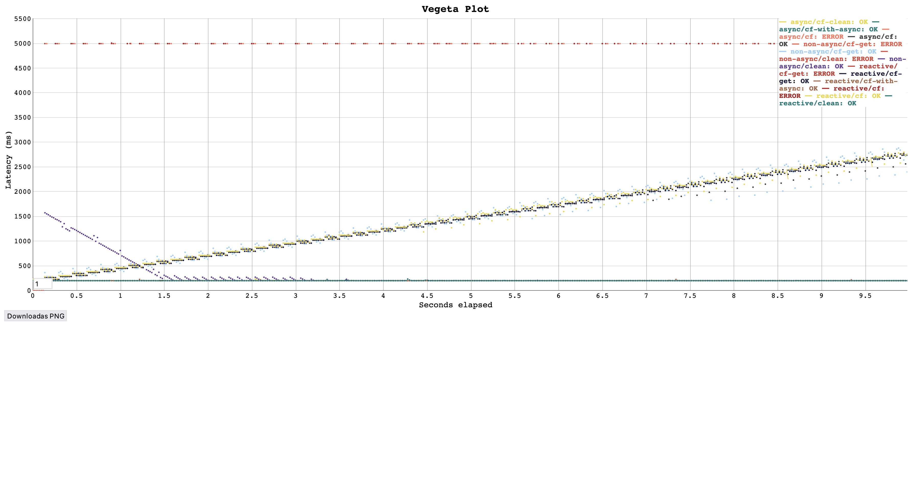


```shell
=======================================
./results_async_cf-clean.bin
Bucket           #    %        Histogram
[0s,     100ms]  0    0.00%
[100ms,  200ms]  0    0.00%
[200ms,  300ms]  500  100.00%  ###########################################################################
[300ms,  500ms]  0    0.00%
[500ms,  1s]     0    0.00%
[1s,     2s]     0    0.00%
[2s,     3s]     0    0.00%
[3s,     5s]     0    0.00%
[5s,     +Inf]   0    0.00%
Requests      [total, rate, throughput]         500, 50.10, 49.10
Duration      [total, attack, wait]             10.183s, 9.98s, 202.653ms
Latencies     [min, mean, 50, 90, 95, 99, max]  201.826ms, 203.533ms, 203.148ms, 203.918ms, 204.543ms, 216.014ms, 236.082ms
Bytes In      [total, mean]                     6500, 13.00
Bytes Out     [total, mean]                     0, 0.00
Success       [ratio]                           100.00%
Status Codes  [code:count]                      200:500
Error Set:
=======================================
./results_async_cf-with-async.bin
Bucket           #    %        Histogram
[0s,     100ms]  0    0.00%
[100ms,  200ms]  0    0.00%
[200ms,  300ms]  500  100.00%  ###########################################################################
[300ms,  500ms]  0    0.00%
[500ms,  1s]     0    0.00%
[1s,     2s]     0    0.00%
[2s,     3s]     0    0.00%
[3s,     5s]     0    0.00%
[5s,     +Inf]   0    0.00%
Requests      [total, rate, throughput]         500, 50.10, 49.11
Duration      [total, attack, wait]             10.182s, 9.98s, 202.045ms
Latencies     [min, mean, 50, 90, 95, 99, max]  201.574ms, 202.822ms, 202.69ms, 203.359ms, 203.566ms, 204.948ms, 226.888ms
Bytes In      [total, mean]                     6500, 13.00
Bytes Out     [total, mean]                     0, 0.00
Success       [ratio]                           100.00%
Status Codes  [code:count]                      200:500
Error Set:
=======================================
./results_async_cf.bin
Bucket           #    %       Histogram
[0s,     100ms]  0    0.00%
[100ms,  200ms]  0    0.00%
[200ms,  300ms]  21   4.20%   ###
[300ms,  500ms]  31   6.20%   ####
[500ms,  1s]     84   16.80%  ############
[1s,     2s]     175  35.00%  ##########################
[2s,     3s]     127  25.40%  ###################
[3s,     5s]     3    0.60%
[5s,     +Inf]   59   11.80%  ########
Requests      [total, rate, throughput]         500, 50.10, 30.36
Duration      [total, attack, wait]             14.527s, 9.98s, 4.547s
Latencies     [min, mean, 50, 90, 95, 99, max]  202.983ms, 1.907s, 1.66s, 5s, 5s, 5.001s, 5.001s
Bytes In      [total, mean]                     5733, 11.47
Bytes Out     [total, mean]                     0, 0.00
Success       [ratio]                           88.20%
Status Codes  [code:count]                      0:59  200:441
Error Set:
Get "http://localhost:8080/async/cf": context deadline exceeded (Client.Timeout exceeded while awaiting headers)
=======================================
./results_non-async_cf-get.bin
Bucket           #    %       Histogram
[0s,     100ms]  0    0.00%
[100ms,  200ms]  0    0.00%
[200ms,  300ms]  17   3.40%   ##
[300ms,  500ms]  34   6.80%   #####
[500ms,  1s]     84   16.80%  ############
[1s,     2s]     175  35.00%  ##########################
[2s,     3s]     129  25.80%  ###################
[3s,     5s]     3    0.60%
[5s,     +Inf]   58   11.60%  ########
Requests      [total, rate, throughput]         500, 50.10, 30.45
Duration      [total, attack, wait]             14.514s, 9.98s, 4.535s
Latencies     [min, mean, 50, 90, 95, 99, max]  203.624ms, 1.914s, 1.659s, 5s, 5s, 5.001s, 5.001s
Bytes In      [total, mean]                     5746, 11.49
Bytes Out     [total, mean]                     0, 0.00
Success       [ratio]                           88.40%
Status Codes  [code:count]                      0:58  200:442
Error Set:
Get "http://localhost:8080/non-async/cf-get": context deadline exceeded (Client.Timeout exceeded while awaiting headers)
=======================================
./results_non-async_clean.bin
Bucket           #    %       Histogram
[0s,     100ms]  7    1.40%   #
[100ms,  200ms]  0    0.00%
[200ms,  300ms]  425  85.00%  ###############################################################
[300ms,  500ms]  12   2.40%   #
[500ms,  1s]     26   5.20%   ###
[1s,     2s]     30   6.00%   ####
[2s,     3s]     0    0.00%
[3s,     5s]     0    0.00%
[5s,     +Inf]   0    0.00%
Requests      [total, rate, throughput]         500, 50.10, 48.41
Duration      [total, attack, wait]             10.184s, 9.98s, 204.029ms
Latencies     [min, mean, 50, 90, 95, 99, max]  775.638µs, 302.812ms, 203.747ms, 593.007ms, 1.104s, 1.484s, 1.576s
Bytes In      [total, mean]                     6409, 12.82
Bytes Out     [total, mean]                     0, 0.00
Success       [ratio]                           98.60%
Status Codes  [code:count]                      0:7  200:493
Error Set:
Get "http://localhost:8080/non-async/clean": read tcp [::1]:64121->[::1]:8080: read: connection reset by peer
Get "http://localhost:8080/non-async/clean": read tcp 127.0.0.1:64123->127.0.0.1:8080: read: connection reset by peer
Get "http://localhost:8080/non-async/clean": read tcp [::1]:64126->[::1]:8080: read: connection reset by peer
Get "http://localhost:8080/non-async/clean": read tcp [::1]:64128->[::1]:8080: read: connection reset by peer
Get "http://localhost:8080/non-async/clean": read tcp 127.0.0.1:64130->127.0.0.1:8080: read: connection reset by peer
Get "http://localhost:8080/non-async/clean": read tcp 127.0.0.1:64131->127.0.0.1:8080: read: connection reset by peer
Get "http://localhost:8080/non-async/clean": read tcp 127.0.0.1:64134->127.0.0.1:8080: read: connection reset by peer
=======================================
./results_reactive_cf-get.bin
Bucket           #    %       Histogram
[0s,     100ms]  0    0.00%
[100ms,  200ms]  0    0.00%
[200ms,  300ms]  21   4.20%   ###
[300ms,  500ms]  32   6.40%   ####
[500ms,  1s]     84   16.80%  ############
[1s,     2s]     171  34.20%  #########################
[2s,     3s]     130  26.00%  ###################
[3s,     5s]     4    0.80%
[5s,     +Inf]   58   11.60%  ########
Requests      [total, rate, throughput]         500, 50.10, 30.45
Duration      [total, attack, wait]             14.514s, 9.98s, 4.534s
Latencies     [min, mean, 50, 90, 95, 99, max]  203.626ms, 1.905s, 1.654s, 5s, 5s, 5.001s, 5.002s
Bytes In      [total, mean]                     5746, 11.49
Bytes Out     [total, mean]                     0, 0.00
Success       [ratio]                           88.40%
Status Codes  [code:count]                      0:58  200:442
Error Set:
Get "http://localhost:8080/reactive/cf-get": context deadline exceeded (Client.Timeout exceeded while awaiting headers)
=======================================
./results_reactive_cf-with-async.bin
Bucket           #    %        Histogram
[0s,     100ms]  0    0.00%
[100ms,  200ms]  0    0.00%
[200ms,  300ms]  500  100.00%  ###########################################################################
[300ms,  500ms]  0    0.00%
[500ms,  1s]     0    0.00%
[1s,     2s]     0    0.00%
[2s,     3s]     0    0.00%
[3s,     5s]     0    0.00%
[5s,     +Inf]   0    0.00%
Requests      [total, rate, throughput]         500, 50.10, 49.10
Duration      [total, attack, wait]             10.183s, 9.98s, 202.578ms
Latencies     [min, mean, 50, 90, 95, 99, max]  201.328ms, 202.675ms, 202.499ms, 203.034ms, 203.444ms, 207.912ms, 227.926ms
Bytes In      [total, mean]                     6500, 13.00
Bytes Out     [total, mean]                     0, 0.00
Success       [ratio]                           100.00%
Status Codes  [code:count]                      200:500
Error Set:
=======================================
./results_reactive_cf.bin
Bucket           #    %       Histogram
[0s,     100ms]  0    0.00%
[100ms,  200ms]  0    0.00%
[200ms,  300ms]  14   2.80%   ##
[300ms,  500ms]  39   7.80%   #####
[500ms,  1s]     84   16.80%  ############
[1s,     2s]     172  34.40%  #########################
[2s,     3s]     130  26.00%  ###################
[3s,     5s]     3    0.60%
[5s,     +Inf]   58   11.60%  ########
Requests      [total, rate, throughput]         500, 50.10, 30.45
Duration      [total, attack, wait]             14.513s, 9.98s, 4.534s
Latencies     [min, mean, 50, 90, 95, 99, max]  203.048ms, 1.914s, 1.66s, 5s, 5s, 5.001s, 5.01s
Bytes In      [total, mean]                     5746, 11.49
Bytes Out     [total, mean]                     0, 0.00
Success       [ratio]                           88.40%
Status Codes  [code:count]                      0:58  200:442
Error Set:
Get "http://localhost:8080/reactive/cf": context deadline exceeded (Client.Timeout exceeded while awaiting headers)
=======================================
./results_reactive_clean.bin
Bucket           #    %        Histogram
[0s,     100ms]  0    0.00%
[100ms,  200ms]  0    0.00%
[200ms,  300ms]  500  100.00%  ###########################################################################
[300ms,  500ms]  0    0.00%
[500ms,  1s]     0    0.00%
[1s,     2s]     0    0.00%
[2s,     3s]     0    0.00%
[3s,     5s]     0    0.00%
[5s,     +Inf]   0    0.00%
Requests      [total, rate, throughput]         500, 50.10, 49.10
Duration      [total, attack, wait]             10.183s, 9.98s, 202.971ms
Latencies     [min, mean, 50, 90, 95, 99, max]  201.617ms, 202.8ms, 202.636ms, 203.267ms, 203.531ms, 206.05ms, 235.856ms
Bytes In      [total, mean]                     6500, 13.00
Bytes Out     [total, mean]                     0, 0.00
Success       [ratio]                           100.00%
Status Codes  [code:count]                      200:500
Error Set:
```
</details>


<details>
  <summary>non-async/clean - Expand to View K6 Report</summary>

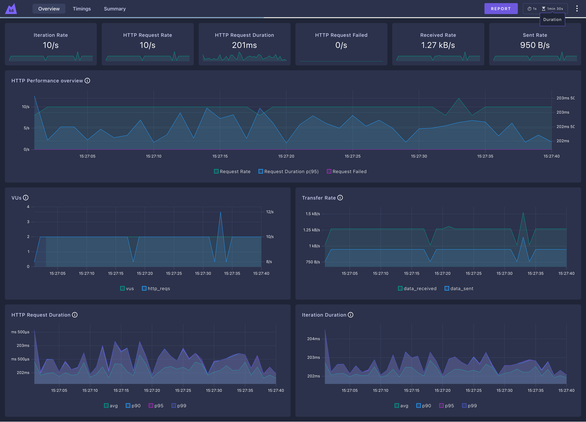


```shell
Testing 'non-async/clean' ...

         /\      Grafana   /‾‾/  
    /\  /  \     |\  __   /  /   
   /  \/    \    | |/ /  /   ‾‾\ 
  /          \   |   (  |  (‾)  |
 / __________ \  |_|\_\  \_____/ 

     execution: local
        script: k6-tests-template.js
        output: dashboard http://127.0.0.1:5665

     scenarios: (100.00%) 1 scenario, 2 max VUs, 1m30s max duration (incl. graceful stop):
              * default: 400 iterations shared among 2 VUs (maxDuration: 1m0s, gracefulStop: 30s)


     █ non-async/clean

       ✓ status is 200

     checks.........................: 100.00% 400 out of 400
     data_received..................: 51 kB   1.3 kB/s
     data_sent......................: 38 kB   939 B/s
     group_duration.................: avg=202.2ms  min=201.6ms  med=202.07ms max=204.35ms p(90)=202.7ms  p(95)=202.88ms
     http_req_blocked...............: avg=7.72µs   min=2µs      med=4µs      max=487µs    p(90)=5µs      p(95)=7µs     
     http_req_connecting............: avg=1.79µs   min=0s       med=0s       max=205µs    p(90)=0s       p(95)=0s      
     http_req_duration..............: avg=202.09ms min=201.49ms med=201.97ms max=203.58ms p(90)=202.56ms p(95)=202.73ms
       { expected_response:true }...: avg=202.09ms min=201.49ms med=201.97ms max=203.58ms p(90)=202.56ms p(95)=202.73ms
     http_req_failed................: 0.00%   0 out of 400
     http_req_receiving.............: avg=56.99µs  min=26µs     med=51µs     max=365µs    p(90)=75.1µs   p(95)=94µs    
     http_req_sending...............: avg=14.82µs  min=6µs      med=12µs     max=266µs    p(90)=18µs     p(95)=22µs    
     http_req_tls_handshaking.......: avg=0s       min=0s       med=0s       max=0s       p(90)=0s       p(95)=0s      
     http_req_waiting...............: avg=202.01ms min=201.44ms med=201.9ms  max=203.41ms p(90)=202.5ms  p(95)=202.65ms
     http_reqs......................: 400     9.888928/s
     iteration_duration.............: avg=202.23ms min=201.62ms med=202.09ms max=204.5ms  p(90)=202.72ms p(95)=202.93ms
     iterations.....................: 400     9.888928/s
     vus............................: 2       min=2          max=2
     vus_max........................: 2       min=2          max=2


running (0m40.4s), 0/2 VUs, 400 complete and 0 interrupted iterations
default ✓ [======================================] 2 VUs  0m40.4s/1m0s  400/400 shared iters
```
</details>

<details>
  <summary>non-async/cf-get - Expand to View K6 Report</summary>

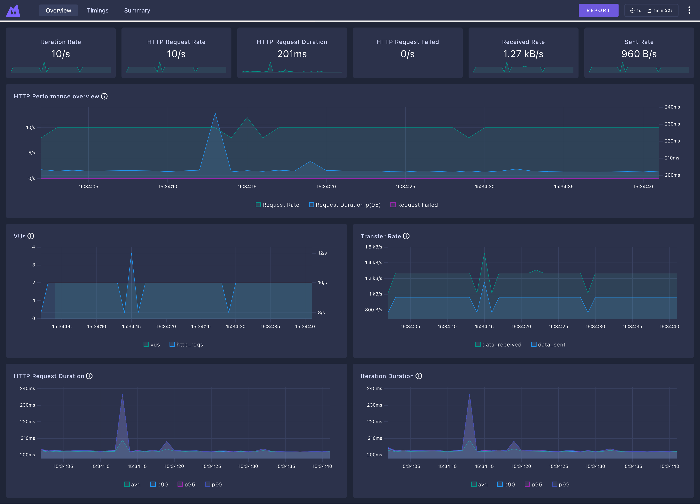


```shell
Testing 'non-async/cf-get' ...

         /\      Grafana   /‾‾/  
    /\  /  \     |\  __   /  /   
   /  \/    \    | |/ /  /   ‾‾\ 
  /          \   |   (  |  (‾)  |
 / __________ \  |_|\_\  \_____/ 

     execution: local
        script: k6-tests-template.js
        output: dashboard http://127.0.0.1:5665

     scenarios: (100.00%) 1 scenario, 2 max VUs, 1m30s max duration (incl. graceful stop):
              * default: 400 iterations shared among 2 VUs (maxDuration: 1m0s, gracefulStop: 30s)


     █ non-async/cf-get

       ✓ status is 200

     checks.........................: 100.00% 400 out of 400
     data_received..................: 51 kB   1.3 kB/s
     data_sent......................: 38 kB   949 B/s
     group_duration.................: avg=202.36ms min=201.26ms med=202.07ms max=236.64ms p(90)=202.71ms p(95)=202.92ms
     http_req_blocked...............: avg=7.56µs   min=2µs      med=4µs      max=456µs    p(90)=6µs      p(95)=7.04µs  
     http_req_connecting............: avg=1.68µs   min=0s       med=0s       max=195µs    p(90)=0s       p(95)=0s      
     http_req_duration..............: avg=202.25ms min=201.16ms med=201.97ms max=236.56ms p(90)=202.6ms  p(95)=202.71ms
       { expected_response:true }...: avg=202.25ms min=201.16ms med=201.97ms max=236.56ms p(90)=202.6ms  p(95)=202.71ms
     http_req_failed................: 0.00%   0 out of 400
     http_req_receiving.............: avg=52.08µs  min=25µs     med=50µs     max=175µs    p(90)=67µs     p(95)=78µs    
     http_req_sending...............: avg=13.58µs  min=6µs      med=12µs     max=74µs     p(90)=18µs     p(95)=22µs    
     http_req_tls_handshaking.......: avg=0s       min=0s       med=0s       max=0s       p(90)=0s       p(95)=0s      
     http_req_waiting...............: avg=202.18ms min=201.11ms med=201.9ms  max=236.51ms p(90)=202.53ms p(95)=202.64ms
     http_reqs......................: 400     9.881245/s
     iteration_duration.............: avg=202.38ms min=201.27ms med=202.09ms max=236.66ms p(90)=202.74ms p(95)=202.94ms
     iterations.....................: 400     9.881245/s
     vus............................: 2       min=2          max=2
     vus_max........................: 2       min=2          max=2


running (0m40.5s), 0/2 VUs, 400 complete and 0 interrupted iterations
default ✓ [======================================] 2 VUs  0m40.5s/1m0s  400/400 shared iters
```
</details>

<details>
  <summary>async/cf-clean - Expand to View K6 Report</summary>

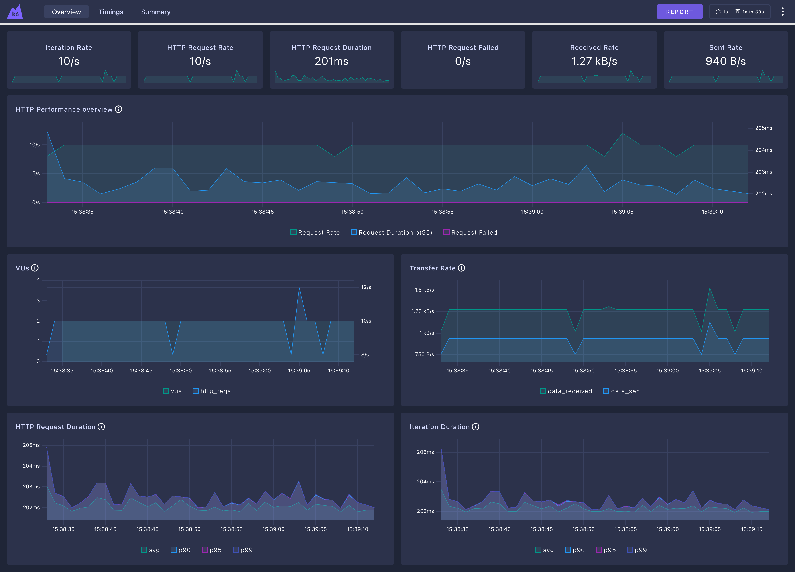


```shell
Testing 'async/cf-clean' ...

         /\      Grafana   /‾‾/  
    /\  /  \     |\  __   /  /   
   /  \/    \    | |/ /  /   ‾‾\ 
  /          \   |   (  |  (‾)  |
 / __________ \  |_|\_\  \_____/ 

     execution: local
        script: k6-tests-template.js
        output: dashboard http://127.0.0.1:5665

     scenarios: (100.00%) 1 scenario, 2 max VUs, 1m30s max duration (incl. graceful stop):
              * default: 400 iterations shared among 2 VUs (maxDuration: 1m0s, gracefulStop: 30s)


     █ async/cf-clean

       ✓ status is 200

     checks.........................: 100.00% 400 out of 400
     data_received..................: 51 kB   1.3 kB/s
     data_sent......................: 38 kB   930 B/s
     group_duration.................: avg=202.18ms min=201.44ms med=202.09ms max=206.3ms  p(90)=202.65ms p(95)=202.81ms
     http_req_blocked...............: avg=10.07µs  min=2µs      med=4µs      max=951µs    p(90)=5µs      p(95)=8µs     
     http_req_connecting............: avg=1.87µs   min=0s       med=0s       max=193µs    p(90)=0s       p(95)=0s      
     http_req_duration..............: avg=202.07ms min=201.35ms med=201.99ms max=204.94ms p(90)=202.55ms p(95)=202.7ms 
       { expected_response:true }...: avg=202.07ms min=201.35ms med=201.99ms max=204.94ms p(90)=202.55ms p(95)=202.7ms 
     http_req_failed................: 0.00%   0 out of 400
     http_req_receiving.............: avg=51.91µs  min=26µs     med=50µs     max=179µs    p(90)=68µs     p(95)=77µs    
     http_req_sending...............: avg=12.92µs  min=7µs      med=11µs     max=77µs     p(90)=17µs     p(95)=21µs    
     http_req_tls_handshaking.......: avg=0s       min=0s       med=0s       max=0s       p(90)=0s       p(95)=0s      
     http_req_waiting...............: avg=202ms    min=201.29ms med=201.93ms max=204.68ms p(90)=202.48ms p(95)=202.64ms
     http_reqs......................: 400     9.889956/s
     iteration_duration.............: avg=202.2ms  min=201.46ms med=202.11ms max=206.43ms p(90)=202.68ms p(95)=202.86ms
     iterations.....................: 400     9.889956/s
     vus............................: 2       min=2          max=2
     vus_max........................: 2       min=2          max=2


running (0m40.4s), 0/2 VUs, 400 complete and 0 interrupted iterations
default ✓ [======================================] 2 VUs  0m40.4s/1m0s  400/400 shared iters
```
</details>

<details>
  <summary>async/cf - Expand to View K6 Report</summary>

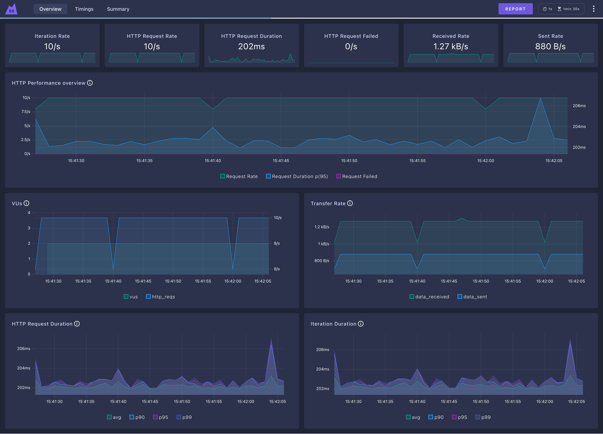


```shell
Testing 'async/cf' ...

         /\      Grafana   /‾‾/  
    /\  /  \     |\  __   /  /   
   /  \/    \    | |/ /  /   ‾‾\ 
  /          \   |   (  |  (‾)  |
 / __________ \  |_|\_\  \_____/ 

     execution: local
        script: k6-tests-template.js
        output: dashboard http://127.0.0.1:5665

     scenarios: (100.00%) 1 scenario, 2 max VUs, 1m30s max duration (incl. graceful stop):
              * default: 400 iterations shared among 2 VUs (maxDuration: 1m0s, gracefulStop: 30s)


     █ async/cf

       ✓ status is 200

     checks.........................: 100.00% 400 out of 400
     data_received..................: 51 kB   1.3 kB/s
     data_sent......................: 35 kB   870 B/s
     group_duration.................: avg=202.26ms min=201.42ms med=202.11ms max=207.2ms  p(90)=202.81ms p(95)=203.01ms
     http_req_blocked...............: avg=8.09µs   min=2µs      med=4µs      max=599µs    p(90)=5µs      p(95)=7µs     
     http_req_connecting............: avg=2.07µs   min=0s       med=0s       max=281µs    p(90)=0s       p(95)=0s      
     http_req_duration..............: avg=202.15ms min=201.35ms med=202.01ms max=207.1ms  p(90)=202.69ms p(95)=202.85ms
       { expected_response:true }...: avg=202.15ms min=201.35ms med=202.01ms max=207.1ms  p(90)=202.69ms p(95)=202.85ms
     http_req_failed................: 0.00%   0 out of 400
     http_req_receiving.............: avg=53.16µs  min=22µs     med=48.5µs   max=160µs    p(90)=73µs     p(95)=89.04µs 
     http_req_sending...............: avg=15.99µs  min=7µs      med=12µs     max=443µs    p(90)=20µs     p(95)=23.14µs 
     http_req_tls_handshaking.......: avg=0s       min=0s       med=0s       max=0s       p(90)=0s       p(95)=0s      
     http_req_waiting...............: avg=202.08ms min=201.32ms med=201.95ms max=206.93ms p(90)=202.59ms p(95)=202.77ms
     http_reqs......................: 400     9.886151/s
     iteration_duration.............: avg=202.28ms min=201.43ms med=202.13ms max=207.21ms p(90)=202.83ms p(95)=203.04ms
     iterations.....................: 400     9.886151/s
     vus............................: 2       min=2          max=2
     vus_max........................: 2       min=2          max=2


running (0m40.5s), 0/2 VUs, 400 complete and 0 interrupted iterations
default ✓ [======================================] 2 VUs  0m40.5s/1m0s  400/400 shared iters
```
</details>

<details>
  <summary>async/cf-with-async - Expand to View K6 Report</summary>

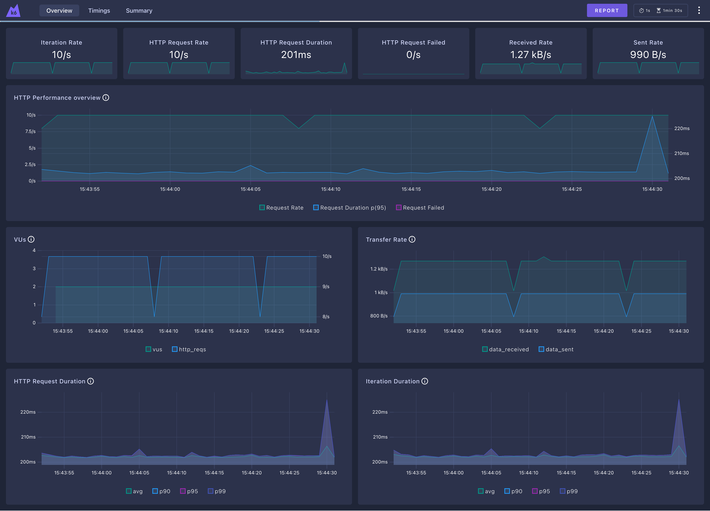


```shell
Testing 'async/cf-with-async' ...

         /\      Grafana   /‾‾/  
    /\  /  \     |\  __   /  /   
   /  \/    \    | |/ /  /   ‾‾\ 
  /          \   |   (  |  (‾)  |
 / __________ \  |_|\_\  \_____/ 

     execution: local
        script: k6-tests-template.js
        output: dashboard http://127.0.0.1:5665

     scenarios: (100.00%) 1 scenario, 2 max VUs, 1m30s max duration (incl. graceful stop):
              * default: 400 iterations shared among 2 VUs (maxDuration: 1m0s, gracefulStop: 30s)


     █ async/cf-with-async

       ✓ status is 200

     checks.........................: 100.00% 400 out of 400
     data_received..................: 51 kB   1.3 kB/s
     data_sent......................: 40 kB   978 B/s
     group_duration.................: avg=202.33ms min=201.46ms med=202.07ms max=225.1ms  p(90)=202.8ms  p(95)=202.95ms
     http_req_blocked...............: avg=9.31µs   min=2µs      med=4µs      max=798µs    p(90)=5µs      p(95)=6µs     
     http_req_connecting............: avg=2.48µs   min=0s       med=0s       max=297µs    p(90)=0s       p(95)=0s      
     http_req_duration..............: avg=202.22ms min=201.38ms med=201.98ms max=225ms    p(90)=202.68ms p(95)=202.83ms
       { expected_response:true }...: avg=202.22ms min=201.38ms med=201.98ms max=225ms    p(90)=202.68ms p(95)=202.83ms
     http_req_failed................: 0.00%   0 out of 400
     http_req_receiving.............: avg=52.78µs  min=27µs     med=49µs     max=147µs    p(90)=69µs     p(95)=80.04µs 
     http_req_sending...............: avg=13.04µs  min=6µs      med=11µs     max=102µs    p(90)=18µs     p(95)=21µs    
     http_req_tls_handshaking.......: avg=0s       min=0s       med=0s       max=0s       p(90)=0s       p(95)=0s      
     http_req_waiting...............: avg=202.16ms min=201.33ms med=201.92ms max=224.92ms p(90)=202.62ms p(95)=202.75ms
     http_reqs......................: 400     9.882503/s
     iteration_duration.............: avg=202.36ms min=201.48ms med=202.09ms max=225.12ms p(90)=202.83ms p(95)=202.98ms
     iterations.....................: 400     9.882503/s
     vus............................: 2       min=2          max=2
     vus_max........................: 2       min=2          max=2


running (0m40.5s), 0/2 VUs, 400 complete and 0 interrupted iterations
default ✓ [======================================] 2 VUs  0m40.5s/1m0s  400/400 shared iters
```
</details>

<details>
  <summary>reactive/clean - Expand to View K6 Report</summary>

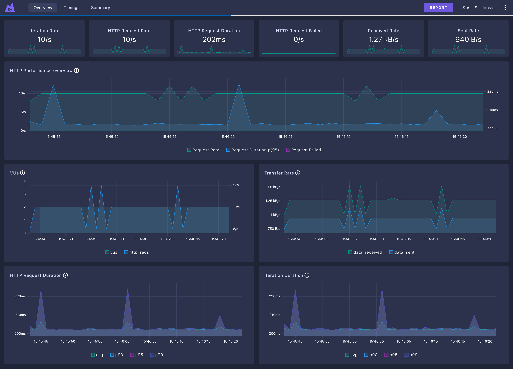


```shell
Testing 'reactive/clean' ...

         /\      Grafana   /‾‾/  
    /\  /  \     |\  __   /  /   
   /  \/    \    | |/ /  /   ‾‾\ 
  /          \   |   (  |  (‾)  |
 / __________ \  |_|\_\  \_____/ 

     execution: local
        script: k6-tests-template.js
        output: dashboard http://127.0.0.1:5665

     scenarios: (100.00%) 1 scenario, 2 max VUs, 1m30s max duration (incl. graceful stop):
              * default: 400 iterations shared among 2 VUs (maxDuration: 1m0s, gracefulStop: 30s)


     █ reactive/clean

       ✓ status is 200

     checks.........................: 100.00% 400 out of 400
     data_received..................: 51 kB   1.3 kB/s
     data_sent......................: 38 kB   929 B/s
     group_duration.................: avg=202.43ms min=201.51ms med=202.1ms  max=224.15ms p(90)=202.71ms p(95)=203.01ms
     http_req_blocked...............: avg=8.04µs   min=2µs      med=4µs      max=576µs    p(90)=5µs      p(95)=5µs     
     http_req_connecting............: avg=1.96µs   min=0s       med=0s       max=207µs    p(90)=0s       p(95)=0s      
     http_req_duration..............: avg=202.33ms min=201.42ms med=201.99ms max=224.06ms p(90)=202.6ms  p(95)=202.85ms
       { expected_response:true }...: avg=202.33ms min=201.42ms med=201.99ms max=224.06ms p(90)=202.6ms  p(95)=202.85ms
     http_req_failed................: 0.00%   0 out of 400
     http_req_receiving.............: avg=53.2µs   min=25µs     med=50µs     max=184µs    p(90)=69.1µs   p(95)=81.09µs 
     http_req_sending...............: avg=14.48µs  min=5µs      med=12µs     max=340µs    p(90)=17.1µs   p(95)=21µs    
     http_req_tls_handshaking.......: avg=0s       min=0s       med=0s       max=0s       p(90)=0s       p(95)=0s      
     http_req_waiting...............: avg=202.26ms min=201.36ms med=201.92ms max=223.99ms p(90)=202.53ms p(95)=202.78ms
     http_reqs......................: 400     9.877628/s
     iteration_duration.............: avg=202.46ms min=201.53ms med=202.11ms max=224.16ms p(90)=202.74ms p(95)=203.04ms
     iterations.....................: 400     9.877628/s
     vus............................: 2       min=2          max=2
     vus_max........................: 2       min=2          max=2


running (0m40.5s), 0/2 VUs, 400 complete and 0 interrupted iterations
default ✓ [======================================] 2 VUs  0m40.5s/1m0s  400/400 shared iters
```
</details>

<details>
  <summary>reactive/cf-get - Expand to View K6 Report</summary>

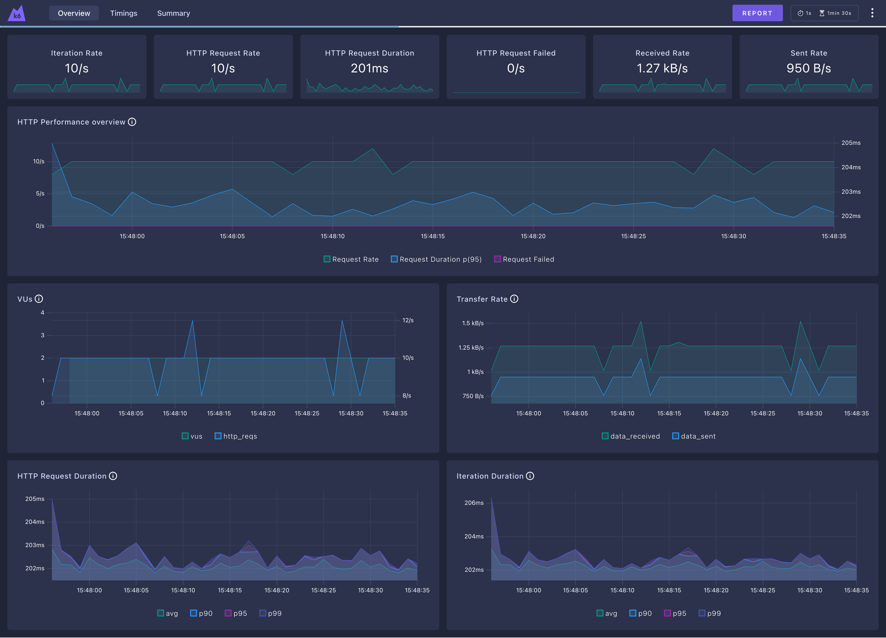


```shell
Testing 'reactive/cf-get' ...

         /\      Grafana   /‾‾/  
    /\  /  \     |\  __   /  /   
   /  \/    \    | |/ /  /   ‾‾\ 
  /          \   |   (  |  (‾)  |
 / __________ \  |_|\_\  \_____/ 

     execution: local
        script: k6-tests-template.js
        output: dashboard http://127.0.0.1:5665

     scenarios: (100.00%) 1 scenario, 2 max VUs, 1m30s max duration (incl. graceful stop):
              * default: 400 iterations shared among 2 VUs (maxDuration: 1m0s, gracefulStop: 30s)


     █ reactive/cf-get

       ✓ status is 200

     checks.........................: 100.00% 400 out of 400
     data_received..................: 51 kB   1.3 kB/s
     data_sent......................: 38 kB   940 B/s
     group_duration.................: avg=202.2ms  min=201.41ms med=202.08ms max=206.2ms  p(90)=202.67ms p(95)=202.9ms 
     http_req_blocked...............: avg=10.2µs   min=2µs      med=4µs      max=900µs    p(90)=5µs      p(95)=6µs     
     http_req_connecting............: avg=2.34µs   min=0s       med=0s       max=263µs    p(90)=0s       p(95)=0s      
     http_req_duration..............: avg=202.09ms min=201.31ms med=201.99ms max=204.99ms p(90)=202.57ms p(95)=202.77ms
       { expected_response:true }...: avg=202.09ms min=201.31ms med=201.99ms max=204.99ms p(90)=202.57ms p(95)=202.77ms
     http_req_failed................: 0.00%   0 out of 400
     http_req_receiving.............: avg=51.32µs  min=26µs     med=49µs     max=142µs    p(90)=67µs     p(95)=75.09µs 
     http_req_sending...............: avg=13.69µs  min=6µs      med=12µs     max=161µs    p(90)=17µs     p(95)=20µs    
     http_req_tls_handshaking.......: avg=0s       min=0s       med=0s       max=0s       p(90)=0s       p(95)=0s      
     http_req_waiting...............: avg=202.02ms min=201.24ms med=201.94ms max=204.75ms p(90)=202.5ms  p(95)=202.7ms 
     http_reqs......................: 400     9.88923/s
     iteration_duration.............: avg=202.22ms min=201.43ms med=202.1ms  max=206.32ms p(90)=202.7ms  p(95)=202.93ms
     iterations.....................: 400     9.88923/s
     vus............................: 2       min=2          max=2
     vus_max........................: 2       min=2          max=2


running (0m40.4s), 0/2 VUs, 400 complete and 0 interrupted iterations
default ✓ [======================================] 2 VUs  0m40.4s/1m0s  400/400 shared iters
```
</details>

<details>
  <summary>reactive/cf - Expand to View K6 Report</summary>

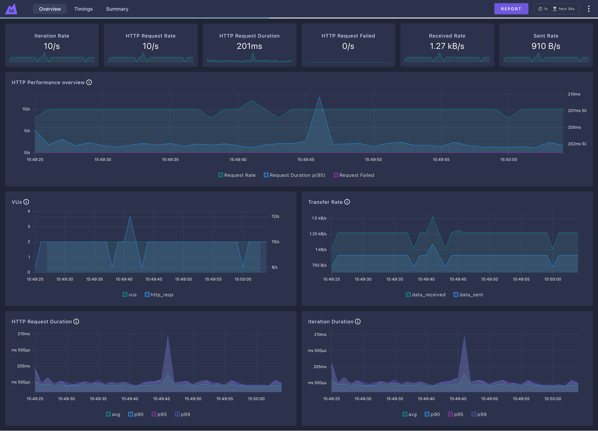


```shell
Testing 'reactive/cf' ...

         /\      Grafana   /‾‾/  
    /\  /  \     |\  __   /  /   
   /  \/    \    | |/ /  /   ‾‾\ 
  /          \   |   (  |  (‾)  |
 / __________ \  |_|\_\  \_____/ 

     execution: local
        script: k6-tests-template.js
        output: dashboard http://127.0.0.1:5665

     scenarios: (100.00%) 1 scenario, 2 max VUs, 1m30s max duration (incl. graceful stop):
              * default: 400 iterations shared among 2 VUs (maxDuration: 1m0s, gracefulStop: 30s)


     █ reactive/cf

       ✓ status is 200

     checks.........................: 100.00% 400 out of 400
     data_received..................: 51 kB   1.3 kB/s
     data_sent......................: 36 kB   900 B/s
     group_duration.................: avg=202.16ms min=201.1ms  med=202.02ms max=209.74ms p(90)=202.58ms p(95)=202.83ms
     http_req_blocked...............: avg=7.4µs    min=2µs      med=3µs      max=511µs    p(90)=5µs      p(95)=6µs     
     http_req_connecting............: avg=1.73µs   min=0s       med=0s       max=183µs    p(90)=0s       p(95)=0s      
     http_req_duration..............: avg=202.06ms min=201.02ms med=201.93ms max=209.66ms p(90)=202.47ms p(95)=202.71ms
       { expected_response:true }...: avg=202.06ms min=201.02ms med=201.93ms max=209.66ms p(90)=202.47ms p(95)=202.71ms
     http_req_failed................: 0.00%   0 out of 400
     http_req_receiving.............: avg=50.4µs   min=25µs     med=48µs     max=188µs    p(90)=66µs     p(95)=75.04µs 
     http_req_sending...............: avg=13.36µs  min=6µs      med=12µs     max=124µs    p(90)=17µs     p(95)=20µs    
     http_req_tls_handshaking.......: avg=0s       min=0s       med=0s       max=0s       p(90)=0s       p(95)=0s      
     http_req_waiting...............: avg=202ms    min=200.97ms med=201.86ms max=209.6ms  p(90)=202.41ms p(95)=202.64ms
     http_reqs......................: 400     9.890816/s
     iteration_duration.............: avg=202.19ms min=201.12ms med=202.04ms max=209.77ms p(90)=202.61ms p(95)=202.88ms
     iterations.....................: 400     9.890816/s
     vus............................: 2       min=2          max=2
     vus_max........................: 2       min=2          max=2


running (0m40.4s), 0/2 VUs, 400 complete and 0 interrupted iterations
default ✓ [======================================] 2 VUs  0m40.4s/1m0s  400/400 shared iters
```
</details>

<details>
  <summary>reactive/cf-with-async - Expand to View K6 Report</summary>

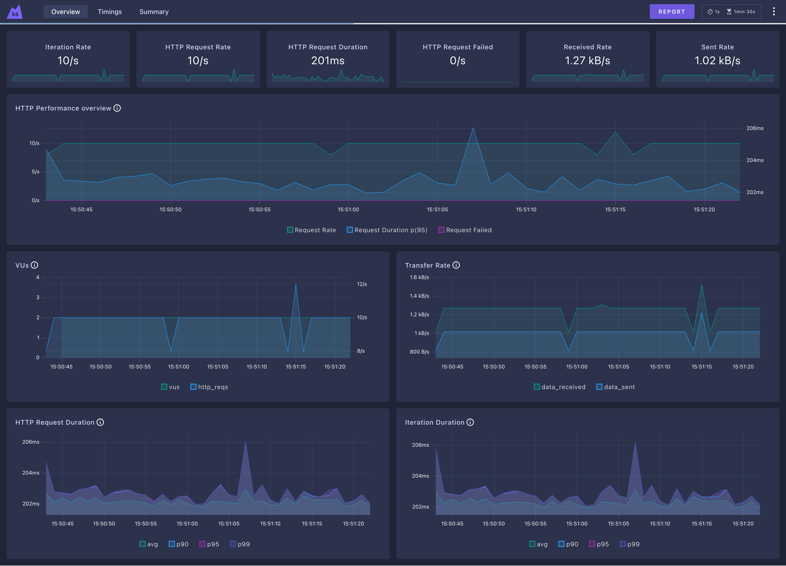


```shell
Testing 'reactive/cf-with-async' ...

         /\      Grafana   /‾‾/  
    /\  /  \     |\  __   /  /   
   /  \/    \    | |/ /  /   ‾‾\ 
  /          \   |   (  |  (‾)  |
 / __________ \  |_|\_\  \_____/ 

     execution: local
        script: k6-tests-template.js
        output: dashboard http://127.0.0.1:5665

     scenarios: (100.00%) 1 scenario, 2 max VUs, 1m30s max duration (incl. graceful stop):
              * default: 400 iterations shared among 2 VUs (maxDuration: 1m0s, gracefulStop: 30s)


     █ reactive/cf-with-async

       ✓ status is 200

     checks.........................: 100.00% 400 out of 400
     data_received..................: 51 kB   1.3 kB/s
     data_sent......................: 41 kB   1.0 kB/s
     group_duration.................: avg=202.26ms min=201.32ms med=202.13ms max=206.16ms p(90)=202.75ms p(95)=203.02ms
     http_req_blocked...............: avg=8.11µs   min=2µs      med=4µs      max=607µs    p(90)=5µs      p(95)=7µs     
     http_req_connecting............: avg=1.78µs   min=0s       med=0s       max=201µs    p(90)=0s       p(95)=0s      
     http_req_duration..............: avg=202.15ms min=201.23ms med=202.03ms max=206.03ms p(90)=202.65ms p(95)=202.91ms
       { expected_response:true }...: avg=202.15ms min=201.23ms med=202.03ms max=206.03ms p(90)=202.65ms p(95)=202.91ms
     http_req_failed................: 0.00%   0 out of 400
     http_req_receiving.............: avg=53.16µs  min=25µs     med=49µs     max=150µs    p(90)=71.1µs   p(95)=88µs    
     http_req_sending...............: avg=13.45µs  min=6µs      med=12µs     max=104µs    p(90)=18µs     p(95)=22µs    
     http_req_tls_handshaking.......: avg=0s       min=0s       med=0s       max=0s       p(90)=0s       p(95)=0s      
     http_req_waiting...............: avg=202.08ms min=201.16ms med=201.97ms max=205.97ms p(90)=202.58ms p(95)=202.83ms
     http_reqs......................: 400     9.886296/s
     iteration_duration.............: avg=202.28ms min=201.34ms med=202.15ms max=206.19ms p(90)=202.77ms p(95)=203.04ms
     iterations.....................: 400     9.886296/s
     vus............................: 2       min=2          max=2
     vus_max........................: 2       min=2          max=2


running (0m40.5s), 0/2 VUs, 400 complete and 0 interrupted iterations
default ✓ [======================================] 2 VUs  0m40.5s/1m0s  400/400 shared iters
```
</details>
