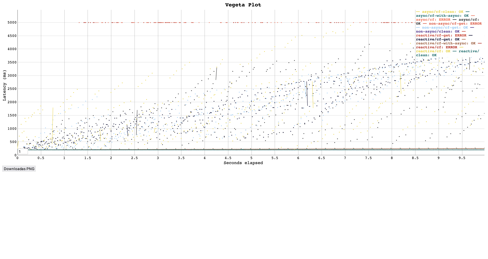
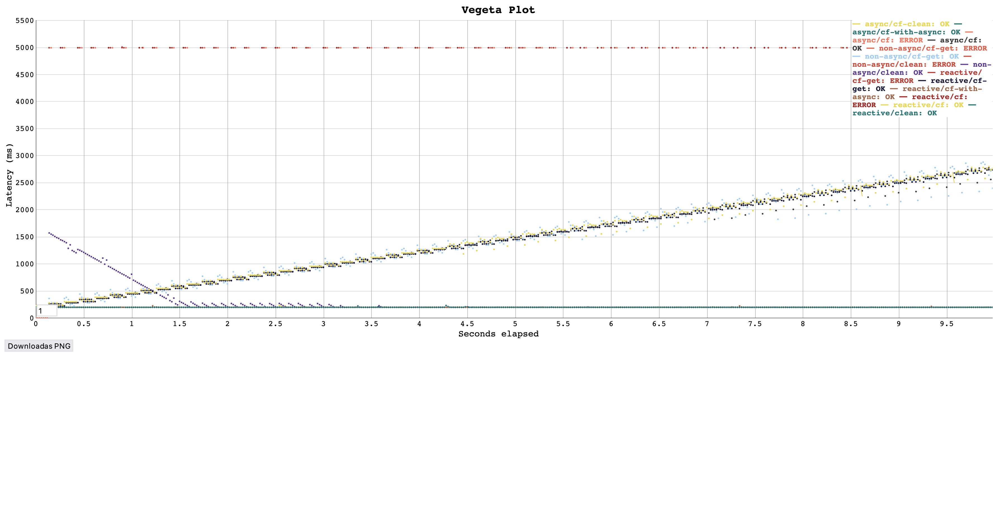

# Performance Comparision

This project contains projects with various performance techniques.

## Frameworks

See the follow for more information on framework-specific notes:

* [Spring Boot](./spring-boot-service/README.md)

## Prepping tests

The test scripts make use of [vegeta](https://github.com/tsenart/vegeta).

```shell
brew install vegeta
```

Launch the service to test:

```shell
cd spring-boot-service
./mvnw clean package
docker compose up --build --force-recreate
```

## Run tests

```shell
./scripts/test.sh
```

# Spring Boot Test Results

### Async (Non-Virtual Threads)



<details>
  <summary>Expand to View Results</summary>
  
```shell
❯ ./report.sh
=======================================
./results_async_cf-clean.bin
Bucket           #    %        Histogram
[0s,     100ms]  0    0.00%
[100ms,  200ms]  0    0.00%
[200ms,  300ms]  500  100.00%  ###########################################################################
[300ms,  500ms]  0    0.00%
[500ms,  1s]     0    0.00%
[1s,     2s]     0    0.00%
[2s,     3s]     0    0.00%
[3s,     5s]     0    0.00%
[5s,     +Inf]   0    0.00%
Requests      [total, rate, throughput]         500, 50.10, 49.11
Duration      [total, attack, wait]             10.182s, 9.98s, 202.003ms
Latencies     [min, mean, 50, 90, 95, 99, max]  201.236ms, 202.073ms, 202.064ms, 202.606ms, 202.783ms, 203.227ms, 204.357ms
Bytes In      [total, mean]                     6500, 13.00
Bytes Out     [total, mean]                     0, 0.00
Success       [ratio]                           100.00%
Status Codes  [code:count]                      200:500
Error Set:
=======================================
./results_async_cf-with-async.bin
Bucket           #    %        Histogram
[0s,     100ms]  0    0.00%
[100ms,  200ms]  0    0.00%
[200ms,  300ms]  500  100.00%  ###########################################################################
[300ms,  500ms]  0    0.00%
[500ms,  1s]     0    0.00%
[1s,     2s]     0    0.00%
[2s,     3s]     0    0.00%
[3s,     5s]     0    0.00%
[5s,     +Inf]   0    0.00%
Requests      [total, rate, throughput]         500, 50.10, 48.87
Duration      [total, attack, wait]             10.232s, 9.981s, 251.262ms
Latencies     [min, mean, 50, 90, 95, 99, max]  202.378ms, 227.285ms, 227.048ms, 246.484ms, 248.808ms, 252.091ms, 252.725ms
Bytes In      [total, mean]                     6500, 13.00
Bytes Out     [total, mean]                     0, 0.00
Success       [ratio]                           100.00%
Status Codes  [code:count]                      200:500
Error Set:
=======================================
./results_async_cf.bin
Bucket           #    %       Histogram
[0s,     100ms]  0    0.00%
[100ms,  200ms]  0    0.00%
[200ms,  300ms]  20   4.00%   ###
[300ms,  500ms]  37   7.40%   #####
[500ms,  1s]     101  20.20%  ###############
[1s,     2s]     126  25.20%  ##################
[2s,     3s]     91   18.20%  #############
[3s,     5s]     72   14.40%  ##########
[5s,     +Inf]   53   10.60%  #######
Requests      [total, rate, throughput]         500, 50.10, 30.80
Duration      [total, attack, wait]             14.514s, 9.981s, 4.533s
Latencies     [min, mean, 50, 90, 95, 99, max]  202.297ms, 2.034s, 1.646s, 5s, 5s, 5.001s, 5.001s
Bytes In      [total, mean]                     5811, 11.62
Bytes Out     [total, mean]                     0, 0.00
Success       [ratio]                           89.40%
Status Codes  [code:count]                      0:53  200:447
Error Set:
Get "http://localhost:8080/async/cf": context deadline exceeded (Client.Timeout exceeded while awaiting headers)
=======================================
./results_non-async_cf-get.bin
Bucket           #    %       Histogram
[0s,     100ms]  0    0.00%
[100ms,  200ms]  0    0.00%
[200ms,  300ms]  24   4.80%   ###
[300ms,  500ms]  35   7.00%   #####
[500ms,  1s]     62   12.40%  #########
[1s,     2s]     129  25.80%  ###################
[2s,     3s]     121  24.20%  ##################
[3s,     5s]     108  21.60%  ################
[5s,     +Inf]   21   4.20%   ###
Requests      [total, rate, throughput]         500, 50.10, 34.44
Duration      [total, attack, wait]             13.91s, 9.98s, 3.93s
Latencies     [min, mean, 50, 90, 95, 99, max]  203.148ms, 2.094s, 1.999s, 3.725s, 4.031s, 5s, 5.001s
Bytes In      [total, mean]                     6227, 12.45
Bytes Out     [total, mean]                     0, 0.00
Success       [ratio]                           95.80%
Status Codes  [code:count]                      0:21  200:479
Error Set:
Get "http://localhost:8080/non-async/cf-get": context deadline exceeded (Client.Timeout exceeded while awaiting headers)
=======================================
./results_non-async_clean.bin
Bucket           #    %        Histogram
[0s,     100ms]  0    0.00%
[100ms,  200ms]  0    0.00%
[200ms,  300ms]  500  100.00%  ###########################################################################
[300ms,  500ms]  0    0.00%
[500ms,  1s]     0    0.00%
[1s,     2s]     0    0.00%
[2s,     3s]     0    0.00%
[3s,     5s]     0    0.00%
[5s,     +Inf]   0    0.00%
Requests      [total, rate, throughput]         500, 50.10, 49.11
Duration      [total, attack, wait]             10.182s, 9.98s, 201.817ms
Latencies     [min, mean, 50, 90, 95, 99, max]  201.029ms, 201.98ms, 201.985ms, 202.527ms, 202.733ms, 203.047ms, 203.75ms
Bytes In      [total, mean]                     6500, 13.00
Bytes Out     [total, mean]                     0, 0.00
Success       [ratio]                           100.00%
Status Codes  [code:count]                      200:500
Error Set:
=======================================
./results_reactive_cf-get.bin
Bucket           #    %       Histogram
[0s,     100ms]  0    0.00%
[100ms,  200ms]  0    0.00%
[200ms,  300ms]  22   4.40%   ###
[300ms,  500ms]  16   3.20%   ##
[500ms,  1s]     75   15.00%  ###########
[1s,     2s]     144  28.80%  #####################
[2s,     3s]     113  22.60%  ################
[3s,     5s]     109  21.80%  ################
[5s,     +Inf]   21   4.20%   ###
Requests      [total, rate, throughput]         500, 50.10, 34.24
Duration      [total, attack, wait]             13.988s, 9.98s, 4.008s
Latencies     [min, mean, 50, 90, 95, 99, max]  203.104ms, 2.106s, 1.922s, 3.711s, 4.045s, 5.001s, 5.001s
Bytes In      [total, mean]                     6227, 12.45
Bytes Out     [total, mean]                     0, 0.00
Success       [ratio]                           95.80%
Status Codes  [code:count]                      0:21  200:479
Error Set:
Get "http://localhost:8080/reactive/cf-get": context deadline exceeded (Client.Timeout exceeded while awaiting headers)
=======================================
./results_reactive_cf-with-async.bin
Bucket           #    %        Histogram
[0s,     100ms]  0    0.00%
[100ms,  200ms]  0    0.00%
[200ms,  300ms]  500  100.00%  ###########################################################################
[300ms,  500ms]  0    0.00%
[500ms,  1s]     0    0.00%
[1s,     2s]     0    0.00%
[2s,     3s]     0    0.00%
[3s,     5s]     0    0.00%
[5s,     +Inf]   0    0.00%
Requests      [total, rate, throughput]         500, 50.10, 48.76
Duration      [total, attack, wait]             10.255s, 9.981s, 274.505ms
Latencies     [min, mean, 50, 90, 95, 99, max]  202.531ms, 229.822ms, 229.902ms, 249.879ms, 253.371ms, 269.975ms, 274.505ms
Bytes In      [total, mean]                     6500, 13.00
Bytes Out     [total, mean]                     0, 0.00
Success       [ratio]                           100.00%
Status Codes  [code:count]                      200:500
Error Set:
=======================================
./results_reactive_cf.bin
Bucket           #    %       Histogram
[0s,     100ms]  0    0.00%
[100ms,  200ms]  0    0.00%
[200ms,  300ms]  7    1.40%   #
[300ms,  500ms]  29   5.80%   ####
[500ms,  1s]     87   17.40%  #############
[1s,     2s]     132  26.40%  ###################
[2s,     3s]     90   18.00%  #############
[3s,     5s]     98   19.60%  ##############
[5s,     +Inf]   57   11.40%  ########
Requests      [total, rate, throughput]         500, 50.10, 29.90
Duration      [total, attack, wait]             14.818s, 9.979s, 4.838s
Latencies     [min, mean, 50, 90, 95, 99, max]  220.456ms, 2.287s, 1.969s, 5s, 5.001s, 5.001s, 5.001s
Bytes In      [total, mean]                     5759, 11.52
Bytes Out     [total, mean]                     0, 0.00
Success       [ratio]                           88.60%
Status Codes  [code:count]                      0:57  200:443
Error Set:
Get "http://localhost:8080/reactive/cf": context deadline exceeded (Client.Timeout exceeded while awaiting headers)
=======================================
./results_reactive_clean.bin
Bucket           #    %        Histogram
[0s,     100ms]  0    0.00%
[100ms,  200ms]  0    0.00%
[200ms,  300ms]  500  100.00%  ###########################################################################
[300ms,  500ms]  0    0.00%
[500ms,  1s]     0    0.00%
[1s,     2s]     0    0.00%
[2s,     3s]     0    0.00%
[3s,     5s]     0    0.00%
[5s,     +Inf]   0    0.00%
Requests      [total, rate, throughput]         500, 50.10, 49.10
Duration      [total, attack, wait]             10.183s, 9.98s, 202.893ms
Latencies     [min, mean, 50, 90, 95, 99, max]  201.183ms, 202.074ms, 202.07ms, 202.714ms, 202.89ms, 203.42ms, 205.215ms
Bytes In      [total, mean]                     6500, 13.00
Bytes Out     [total, mean]                     0, 0.00
Success       [ratio]                           100.00%
Status Codes  [code:count]                      200:500
Error Set:

```
</details>

### Virtual Threads



<details>
  <summary>Expand to View Results</summary>

```shell
❯ ./report.sh
=======================================
./results_async_cf-clean.bin
Bucket           #    %        Histogram
[0s,     100ms]  0    0.00%
[100ms,  200ms]  0    0.00%
[200ms,  300ms]  500  100.00%  ###########################################################################
[300ms,  500ms]  0    0.00%
[500ms,  1s]     0    0.00%
[1s,     2s]     0    0.00%
[2s,     3s]     0    0.00%
[3s,     5s]     0    0.00%
[5s,     +Inf]   0    0.00%
Requests      [total, rate, throughput]         500, 50.10, 49.10
Duration      [total, attack, wait]             10.183s, 9.98s, 202.653ms
Latencies     [min, mean, 50, 90, 95, 99, max]  201.826ms, 203.533ms, 203.148ms, 203.918ms, 204.543ms, 216.014ms, 236.082ms
Bytes In      [total, mean]                     6500, 13.00
Bytes Out     [total, mean]                     0, 0.00
Success       [ratio]                           100.00%
Status Codes  [code:count]                      200:500
Error Set:
=======================================
./results_async_cf-with-async.bin
Bucket           #    %        Histogram
[0s,     100ms]  0    0.00%
[100ms,  200ms]  0    0.00%
[200ms,  300ms]  500  100.00%  ###########################################################################
[300ms,  500ms]  0    0.00%
[500ms,  1s]     0    0.00%
[1s,     2s]     0    0.00%
[2s,     3s]     0    0.00%
[3s,     5s]     0    0.00%
[5s,     +Inf]   0    0.00%
Requests      [total, rate, throughput]         500, 50.10, 49.11
Duration      [total, attack, wait]             10.182s, 9.98s, 202.045ms
Latencies     [min, mean, 50, 90, 95, 99, max]  201.574ms, 202.822ms, 202.69ms, 203.359ms, 203.566ms, 204.948ms, 226.888ms
Bytes In      [total, mean]                     6500, 13.00
Bytes Out     [total, mean]                     0, 0.00
Success       [ratio]                           100.00%
Status Codes  [code:count]                      200:500
Error Set:
=======================================
./results_async_cf.bin
Bucket           #    %       Histogram
[0s,     100ms]  0    0.00%
[100ms,  200ms]  0    0.00%
[200ms,  300ms]  21   4.20%   ###
[300ms,  500ms]  31   6.20%   ####
[500ms,  1s]     84   16.80%  ############
[1s,     2s]     175  35.00%  ##########################
[2s,     3s]     127  25.40%  ###################
[3s,     5s]     3    0.60%
[5s,     +Inf]   59   11.80%  ########
Requests      [total, rate, throughput]         500, 50.10, 30.36
Duration      [total, attack, wait]             14.527s, 9.98s, 4.547s
Latencies     [min, mean, 50, 90, 95, 99, max]  202.983ms, 1.907s, 1.66s, 5s, 5s, 5.001s, 5.001s
Bytes In      [total, mean]                     5733, 11.47
Bytes Out     [total, mean]                     0, 0.00
Success       [ratio]                           88.20%
Status Codes  [code:count]                      0:59  200:441
Error Set:
Get "http://localhost:8080/async/cf": context deadline exceeded (Client.Timeout exceeded while awaiting headers)
=======================================
./results_non-async_cf-get.bin
Bucket           #    %       Histogram
[0s,     100ms]  0    0.00%
[100ms,  200ms]  0    0.00%
[200ms,  300ms]  17   3.40%   ##
[300ms,  500ms]  34   6.80%   #####
[500ms,  1s]     84   16.80%  ############
[1s,     2s]     175  35.00%  ##########################
[2s,     3s]     129  25.80%  ###################
[3s,     5s]     3    0.60%
[5s,     +Inf]   58   11.60%  ########
Requests      [total, rate, throughput]         500, 50.10, 30.45
Duration      [total, attack, wait]             14.514s, 9.98s, 4.535s
Latencies     [min, mean, 50, 90, 95, 99, max]  203.624ms, 1.914s, 1.659s, 5s, 5s, 5.001s, 5.001s
Bytes In      [total, mean]                     5746, 11.49
Bytes Out     [total, mean]                     0, 0.00
Success       [ratio]                           88.40%
Status Codes  [code:count]                      0:58  200:442
Error Set:
Get "http://localhost:8080/non-async/cf-get": context deadline exceeded (Client.Timeout exceeded while awaiting headers)
=======================================
./results_non-async_clean.bin
Bucket           #    %       Histogram
[0s,     100ms]  7    1.40%   #
[100ms,  200ms]  0    0.00%
[200ms,  300ms]  425  85.00%  ###############################################################
[300ms,  500ms]  12   2.40%   #
[500ms,  1s]     26   5.20%   ###
[1s,     2s]     30   6.00%   ####
[2s,     3s]     0    0.00%
[3s,     5s]     0    0.00%
[5s,     +Inf]   0    0.00%
Requests      [total, rate, throughput]         500, 50.10, 48.41
Duration      [total, attack, wait]             10.184s, 9.98s, 204.029ms
Latencies     [min, mean, 50, 90, 95, 99, max]  775.638µs, 302.812ms, 203.747ms, 593.007ms, 1.104s, 1.484s, 1.576s
Bytes In      [total, mean]                     6409, 12.82
Bytes Out     [total, mean]                     0, 0.00
Success       [ratio]                           98.60%
Status Codes  [code:count]                      0:7  200:493
Error Set:
Get "http://localhost:8080/non-async/clean": read tcp [::1]:64121->[::1]:8080: read: connection reset by peer
Get "http://localhost:8080/non-async/clean": read tcp 127.0.0.1:64123->127.0.0.1:8080: read: connection reset by peer
Get "http://localhost:8080/non-async/clean": read tcp [::1]:64126->[::1]:8080: read: connection reset by peer
Get "http://localhost:8080/non-async/clean": read tcp [::1]:64128->[::1]:8080: read: connection reset by peer
Get "http://localhost:8080/non-async/clean": read tcp 127.0.0.1:64130->127.0.0.1:8080: read: connection reset by peer
Get "http://localhost:8080/non-async/clean": read tcp 127.0.0.1:64131->127.0.0.1:8080: read: connection reset by peer
Get "http://localhost:8080/non-async/clean": read tcp 127.0.0.1:64134->127.0.0.1:8080: read: connection reset by peer
=======================================
./results_reactive_cf-get.bin
Bucket           #    %       Histogram
[0s,     100ms]  0    0.00%
[100ms,  200ms]  0    0.00%
[200ms,  300ms]  21   4.20%   ###
[300ms,  500ms]  32   6.40%   ####
[500ms,  1s]     84   16.80%  ############
[1s,     2s]     171  34.20%  #########################
[2s,     3s]     130  26.00%  ###################
[3s,     5s]     4    0.80%
[5s,     +Inf]   58   11.60%  ########
Requests      [total, rate, throughput]         500, 50.10, 30.45
Duration      [total, attack, wait]             14.514s, 9.98s, 4.534s
Latencies     [min, mean, 50, 90, 95, 99, max]  203.626ms, 1.905s, 1.654s, 5s, 5s, 5.001s, 5.002s
Bytes In      [total, mean]                     5746, 11.49
Bytes Out     [total, mean]                     0, 0.00
Success       [ratio]                           88.40%
Status Codes  [code:count]                      0:58  200:442
Error Set:
Get "http://localhost:8080/reactive/cf-get": context deadline exceeded (Client.Timeout exceeded while awaiting headers)
=======================================
./results_reactive_cf-with-async.bin
Bucket           #    %        Histogram
[0s,     100ms]  0    0.00%
[100ms,  200ms]  0    0.00%
[200ms,  300ms]  500  100.00%  ###########################################################################
[300ms,  500ms]  0    0.00%
[500ms,  1s]     0    0.00%
[1s,     2s]     0    0.00%
[2s,     3s]     0    0.00%
[3s,     5s]     0    0.00%
[5s,     +Inf]   0    0.00%
Requests      [total, rate, throughput]         500, 50.10, 49.10
Duration      [total, attack, wait]             10.183s, 9.98s, 202.578ms
Latencies     [min, mean, 50, 90, 95, 99, max]  201.328ms, 202.675ms, 202.499ms, 203.034ms, 203.444ms, 207.912ms, 227.926ms
Bytes In      [total, mean]                     6500, 13.00
Bytes Out     [total, mean]                     0, 0.00
Success       [ratio]                           100.00%
Status Codes  [code:count]                      200:500
Error Set:
=======================================
./results_reactive_cf.bin
Bucket           #    %       Histogram
[0s,     100ms]  0    0.00%
[100ms,  200ms]  0    0.00%
[200ms,  300ms]  14   2.80%   ##
[300ms,  500ms]  39   7.80%   #####
[500ms,  1s]     84   16.80%  ############
[1s,     2s]     172  34.40%  #########################
[2s,     3s]     130  26.00%  ###################
[3s,     5s]     3    0.60%
[5s,     +Inf]   58   11.60%  ########
Requests      [total, rate, throughput]         500, 50.10, 30.45
Duration      [total, attack, wait]             14.513s, 9.98s, 4.534s
Latencies     [min, mean, 50, 90, 95, 99, max]  203.048ms, 1.914s, 1.66s, 5s, 5s, 5.001s, 5.01s
Bytes In      [total, mean]                     5746, 11.49
Bytes Out     [total, mean]                     0, 0.00
Success       [ratio]                           88.40%
Status Codes  [code:count]                      0:58  200:442
Error Set:
Get "http://localhost:8080/reactive/cf": context deadline exceeded (Client.Timeout exceeded while awaiting headers)
=======================================
./results_reactive_clean.bin
Bucket           #    %        Histogram
[0s,     100ms]  0    0.00%
[100ms,  200ms]  0    0.00%
[200ms,  300ms]  500  100.00%  ###########################################################################
[300ms,  500ms]  0    0.00%
[500ms,  1s]     0    0.00%
[1s,     2s]     0    0.00%
[2s,     3s]     0    0.00%
[3s,     5s]     0    0.00%
[5s,     +Inf]   0    0.00%
Requests      [total, rate, throughput]         500, 50.10, 49.10
Duration      [total, attack, wait]             10.183s, 9.98s, 202.971ms
Latencies     [min, mean, 50, 90, 95, 99, max]  201.617ms, 202.8ms, 202.636ms, 203.267ms, 203.531ms, 206.05ms, 235.856ms
Bytes In      [total, mean]                     6500, 13.00
Bytes Out     [total, mean]                     0, 0.00
Success       [ratio]                           100.00%
Status Codes  [code:count]                      200:500
Error Set:

```
</details>